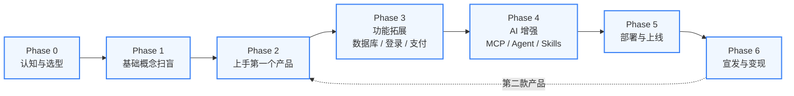

# VibeMaker 学习路径：从「不懂技术」到「做出第一个 AI 产品并卖出第一份订阅」

> 本路径是 VibeMaker 的主线骨架。沿着它一步步走，每一阶段都挂着对应的「知识卡片」与「Skills 资产」。
> 不一定要按顺序学完每一张卡——遇到不懂的随时退回去看，或者扔给侧边栏 AI 让它讲一遍。

---

## 主线总览

---

## Phase 0 · 认知与选型

> **学完你能做什么**：能用自己的话说清楚"vibe coding 是什么、和传统编程区别在哪、为什么 2026 年是适合做的时间点"；能根据自己的背景挑出第一款要用的 AI 工具。

**核心目标**
- 理解：人类不再"敲代码"，而是"描述意图 → AI 写代码"
- 选定第一款"驾驶舱"：从 Cursor / Lovable / Trae / 通义灵码 中挑一个
- 选定第一个"大脑"：知道默认用什么模型、什么时候切

**挂载卡片**
- B-01 主流大模型全景图
- C-决策树 工具选型决策树（看完这张图就知道自己该用哪个）
- C-01 Cursor / C-03 Lovable / C-09 Trae / C-10 通义灵码（按决策树结果挑读 1-2 张）

**推荐资料**
- Andrej Karpathy 「vibe coding」原始定义（X 帖子）
- VibeMaker 资料库 `02-resources/resources.md` § A 入门

**🎬 推荐视频路线**
| 顺序 | 视频 | 时长 | 说明 |
|---|---|---|---|
| 1 | [Andrej Karpathy: Intro to Large Language Models](https://www.youtube.com/watch?v=zjkBMFhNj_g) | 1h | 理解 LLM 为什么改变了编程 |
| 2 | [Cursor AI 新手入门 (B站)](https://www.bilibili.com/video/BV1ZM4m1y7Pm) | 20min | 选一个驾驶舱，先跑起来 |
| 3 | [vibe coding 是什么 (YouTube)](https://www.youtube.com/watch?v=3UCtX1E0DOs) | 10min | 概念扫盲，建立信心 |

**完成标志**：能回答这两个问题——"我接下来要用哪个工具？" + "默认配什么模型？"

---

## Phase 1 · 基础概念扫盲

> **学完你能做什么**：看到 LLM、Token、Prompt、Function Calling、RAG、Agent 这些词不再两眼一黑；能听懂 AI 朋友们的对话；能写出"像样的" prompt。

**核心目标**
- 把 A 组 12 张概念卡过一遍——不用记住细节，知道"是什么、有什么用"即可
- 学会写好 prompt：背景 + 角色 + 任务 + 约束 + 输出格式

**挂载卡片（A 组全部）**
- A-01 LLM · A-02 Token / 上下文窗口 · A-03 Prompt · A-04 System Prompt
- A-05 模型幻觉 · A-06 Function Calling · A-07 Agent · A-08 RAG
- A-09 向量数据库 · A-10 Streaming · A-11 Embedding · A-12 Prompt Engineering

**配套 Skills**
- `03-skills-repo/prompts.md` P-01 ~ P-04（产品启动 / 报错解决 / UI 描述 / 功能迭代）

**🎬 推荐视频路线**
| 顺序 | 视频 | 时长 | 对应卡片 |
|---|---|---|---|
| 1 | [3Blue1Brown: But what is a GPT?](https://www.youtube.com/watch?v=wjZofJX0vr4) | 27min | A-01 LLM 原理 |
| 2 | [Karpathy: Let's build the GPT Tokenizer](https://www.youtube.com/watch?v=zduSFxRajkE) | 20min | A-02 Token |
| 3 | [吴恩达: ChatGPT Prompt Engineering](https://www.deeplearning.ai/short-courses/chatgpt-prompt-engineering-for-developers/) | 1h | A-03/A-12 Prompt |
| 4 | [Prompt Engineering 中文教程 (B站)](https://www.bilibili.com/video/BV1no4y1M7Zf) | 30min | A-12 进阶技巧 |
| 5 | [RAG from Scratch (YouTube)](https://www.youtube.com/watch?v=tcqQJNhAxHg) | 系列 | A-08 RAG |
| 6 | [AI Agent 入门 (B站)](https://www.bilibili.com/video/BV1q4421S7B5) | 系列 | A-07 Agent |

**完成标志**：能给一个完全不懂的朋友用"打比方"的方式讲清楚 LLM、RAG、Agent 三个概念。

---

## Phase 2 · 上手第一个产品（最关键的 45 分钟）

> **学完你能做什么**：从一个空文件夹开始，在 45 分钟内做出一个能跑的网页产品（落地页 / 工具站 / 小应用），并在 localhost 看到它。

**核心目标**
- 在选好的"驾驶舱"里启动一个项目
- 让 AI 生成第一版页面，自己改 1-2 个细节
- 看懂 `package.json` 和 `npm run dev` 在做什么

**挂载卡片**
- C-01 Cursor 或 C-03 Lovable（按 Phase 0 的选择）
- E-04 React · E-05 Next.js · E-06 Tailwind · E-08 npm
- A-12 Prompt Engineering（用得到的就是这个）

**配套 Skills**
- `workflows.md` W-01「0 到部署 45 分钟」
- `starter-templates.md` T-02 落地页模板 / T-03 个人工具模板
- `prompts.md` P-01 产品启动 prompt

**🎬 推荐视频路线**
| 顺序 | 视频 | 时长 | 对应卡片 |
|---|---|---|---|
| 1 | [Cursor 新手完整教程 (YouTube)](https://www.youtube.com/watch?v=g_Y9ZVCoq78) | 30min | C-01 Cursor |
| 2 | [React 官方入门教程 (YouTube)](https://www.youtube.com/watch?v=T_nDC0zB5Jg) | 1h | E-04 React |
| 3 | [Next.js 官方教程](https://nextjs.org/learn) | 互动 | E-05 Next.js |
| 4 | [Tailwind CSS 官方教程](https://www.youtube.com/watch?v=hdGsFpZ0J2E) | 1h | E-06 Tailwind |
| 5 | [shadcn/ui 入门 (YouTube)](https://www.youtube.com/watch?v=6dMjCa0nLHB) | 15min | E-07 shadcn |

**完成标志**：localhost 上能打开你的产品页面，能截图发朋友圈说"这是我做的"。

---

## Phase 3 · 功能拓展（数据库 / 登录 / 支付）

> **学完你能做什么**：让你的产品从"一个静态页面"变成"能存数据、能让用户登录、能收钱"的真正产品。

**核心目标**
- 接 Supabase：让产品能存数据（用户、订单、内容……）
- 接 Auth：让用户能用 Google / 邮箱注册登录
- 接 Stripe：让用户能付费

**挂载卡片**
- F-01 API/REST · F-02 数据库与 SQL · F-03 Supabase · F-04 Auth
- F-05 .env · F-08 Stripe

**配套 Skills**
- `workflows.md` W-02 接 Supabase · W-03 接 Stripe
- `mcp-configs.md` M-01 Supabase MCP · M-05 Stripe MCP
- `cursor-rules.md` CR-01 Next.js + Tailwind + Supabase 全栈规则

**🎬 推荐视频路线**
| 顺序 | 视频 | 时长 | 对应卡片 |
|---|---|---|---|
| 1 | [Supabase 官方教程](https://www.youtube.com/watch?v=7uKQBl9uZ00) | 20min | F-03 Supabase |
| 2 | [Supabase + Next.js 实战](https://www.youtube.com/watch?v=8KJtTvbRygM) | 45min | F-03 全栈搭建 |
| 3 | [NextAuth.js 完整教程](https://www.youtube.com/watch?v=DJvM2lSPn6w) | 30min | F-04 Auth |
| 4 | [Stripe Checkout 教程](https://www.youtube.com/watch?v=7uKQBl9uZ00) | 20min | F-08 Stripe |
| 5 | [Stripe + Next.js 订阅系统](https://www.youtube.com/watch?v=8KJtTvbRygM) | 45min | F-08 完整支付 |

**完成标志**：能让一个新用户注册、登录、付费订阅、看到只有付费用户能看的内容。

---

## Phase 4 · AI 增强（MCP / Agent / Skills）

> **学完你能做什么**：让你的产品"长出 AI 大脑"——能调用工具、能查数据库、能多步骤完成任务，而不只是一个套了 ChatGPT 壳的对话框。

**核心目标**
- 给驾驶舱配上 MCP：让 Cursor / Claude Code 能直接读你的数据库、操作你的 GitHub
- 理解 Agent 的"思考 - 调用工具 - 再思考"循环
- 学会写 Cursor Rules，把你的代码规范固化下来

**挂载卡片**
- D-01 ~ D-06 全部（MCP 概念 / 配置 / Server 导航 / Cursor Rules / Agent / Skill）
- A-06 Function Calling · A-07 Agent · A-08 RAG

**配套 Skills**
- `mcp-configs.md` M-01 ~ M-08（全部 8 个 MCP 配置）
- `cursor-rules.md` CR-01 ~ CR-06
- `workflows.md` W-05 配 Cursor + MCP · W-06 AI 流式输出

**🎬 推荐视频路线**
| 顺序 | 视频 | 时长 | 对应卡片 |
|---|---|---|---|
| 1 | [MCP 入门教程 (YouTube)](https://www.youtube.com/watch?v=kQmXtrmQ5Zs) | 15min | D-01 MCP 概念 |
| 2 | [MCP 配置实战 (B站)](https://www.bilibili.com/video/BV1rC41187rS) | 20min | D-02 MCP 配置 |
| 3 | [Cursor Rules 完全指南 (YouTube)](https://www.youtube.com/watch?v=1WS912rT3gA) | 18min | D-04 Cursor Rules |
| 4 | [吴恩达: AI Agents in LangGraph](https://www.deeplearning.ai/short-courses/ai-agents-in-langgraph/) | 1h | A-07 Agent |
| 5 | [ReAct Pattern Explained](https://www.youtube.com/watch?v=0g2jZpj1vKg) | 15min | A-07 Agent 模式 |

**完成标志**：在 Cursor 里说一句"看看我的 Supabase 用户表，给我加一个根据用户偏好推荐内容的接口"，它能自己读表、写代码、迁移数据库。

---

## Phase 5 · 部署与上线

> **学完你能做什么**：把 localhost 上的产品搬到公网，让全世界的人都能访问；配上自己的域名和 HTTPS；之后每次 `git push` 都能自动重新部署。

**核心目标**
- 把代码推到 GitHub
- 用 Vercel（海外）或 Zeabur / EdgeOne（国内友好）连接并自动部署
- 买域名、解析 DNS、自动 HTTPS

**挂载卡片**
- G-01 Vercel（重点，全流程）或 G-07 Zeabur / G-09 EdgeOne（国内）
- G-12 域名与 DNS · G-13 SSL/HTTPS / Git 最小必要
- G-选型 platform-selection.md

**配套 Skills**
- `workflows.md` W-01「0 到部署」收尾的部署部分 · W-04 配自定义域名
- `cursor-rules.md` CR-05 代码安全（部署前一定看一眼）

**🎬 推荐视频路线**
| 顺序 | 视频 | 时长 | 对应卡片 |
|---|---|---|---|
| 1 | [Vercel 部署 Next.js 教程](https://www.youtube.com/watch?v=ZVnjDlHP3vY) | 15min | G-01 Vercel |
| 2 | [Git 入门 (YouTube)](https://www.youtube.com/watch?v=hwP7WQkmECE) | 20min | G-13 Git |
| 3 | [域名购买与 DNS 配置 (B站)](https://www.bilibili.com/video/BV1ZM4m1y7Pm) | 15min | G-12 DNS |
| 4 | [Cloudflare DNS + SSL 配置](https://www.youtube.com/watch?v=dU-xk852pvk) | 12min | G-12/G-13 |

**完成标志**：在浏览器地址栏敲 `https://yourname.com`，能看到你的产品，浏览器锁图标是绿的。

---

## Phase 6 · 宣发与变现

> **学完你能做什么**：让你的产品被世界看见——上 Product Hunt、在 X 做 Build in Public、在小红书 / 即刻吸引种子用户；定好价格收到第一笔订阅。

**核心目标**
- 写好 launch 文案（PH 标题、X thread、小红书笔记）
- 在合适的社区发对的内容（不被当成广告删帖）
- 设计 free / pro 定价、上 Stripe 收款
- 把产品扔进 VibeMaker 发布广场，让其他 vibe coder 看到

**挂载卡片**
- H-01 Product Hunt · H-02 X BIP · H-03 小红书 · H-04 Reddit · H-05 即刻
- H-06 SaaS 定价 · H-07 找到第一个用户 · H-08 变现案例库

**配套 Skills**
- `prompts.md` P-10 落地页文案 · P-11 PH 文案 · P-12 X thread · P-13 小红书笔记
- `workflows.md` W-07 SEO 基础

**🎬 推荐视频路线**
| 顺序 | 视频 | 时长 | 对应卡片 |
|---|---|---|---|
| 1 | [Product Hunt Launch Guide](https://www.youtube.com/watch?v=g_Y9ZVCoq78) | 20min | H-01 PH |
| 2 | [Finding Your First 100 Users](https://www.youtube.com/watch?v=g_Y9ZVCoq78) | 20min | H-07 获客 |
| 3 | [SaaS Pricing Strategy](https://www.youtube.com/watch?v=3UCtX1E0DOs) | 15min | H-06 定价 |
| 4 | [Build in Public 经验分享](https://www.youtube.com/watch?v=3UCtX1E0DOs) | 15min | H-02 BIP |
| 5 | [小红书运营入门](https://www.bilibili.com/video/BV1ZM4m1y7Pm) | 30min | H-03 小红书 |

**完成标志**：拿到第一个**不是你朋友**的真实付费用户。这一刻你就从 vibe coder 进化成独立开发者了。

---

## 怎么用这条路径

1. **不需要线性学完再开始**：在 Phase 0 选好工具后就可以直接跳到 Phase 2 动手；遇到不懂的概念回 Phase 1 翻卡片。
2. **每张卡都有「去问 AI」字段**：把那句 prompt 复制给侧边栏 AI，它会用你听得懂的方式再讲一遍。
3. **Skills 仓库是你的工具箱**：模板、提示词、配置文件，全是「拿来就能用」的；不用自己从头写。
4. **学完一阶段就发一次广场**：哪怕只是个落地页，发出去 → 拿反馈 → 改 → 再发，这是 vibe coder 最重要的循环。

---

## 一张速查图：每阶段去哪里取东西

| 阶段 | 看哪几张卡 | 用哪些 Skills | 完成标志 |
|---|---|---|---|
| P0 认知选型 | B-01, C-决策树 | — | 选好工具+模型 |
| P1 概念扫盲 | A-01 ~ A-12 | P-01 ~ P-04 | 能给朋友讲清三个概念 |
| P2 第一个产品 | C-01/03, E-04/05/06/08 | W-01, T-02/03, P-01 | localhost 跑起来 |
| P3 功能拓展 | F-01 ~ F-05, F-08 | W-02/03, M-01/05, CR-01 | 用户能付费 |
| P4 AI 增强 | D-01 ~ D-06, A-06/07/08 | M-01 ~ M-08, CR-01 ~ CR-06, W-05/06 | AI 能自己查表写代码 |
| P5 部署 | G-01 或 G-07/09, G-12/13 | W-01 部署部分, W-04 | 域名 + HTTPS 上线 |
| P6 宣发变现 | H-01 ~ H-08 | P-10 ~ P-13, W-07 | 第一个付费陌生用户 |

---

**最后一句话**：这条路径不是"教程"，是地图。你随时可以偏离去探索；只要最终走到 Phase 6，就赢了。
