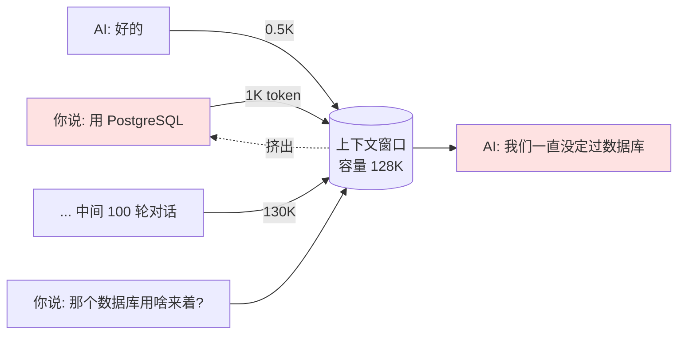

# A-02 Token 与上下文窗口

## 一句话定义
Token 是 LLM 看到的"最小文字单位"（不是字、不是词，介于两者之间）；上下文窗口是它一次能装下的 token 总数——超过这个数，前面的就会被遗忘。

## 打个比方
把 LLM 想象成一个**只有一张办公桌的助理**。
- **Token** 是一张张便签纸。一个中文字大约 1–2 张便签，一个英文单词大约 1 张便签。
- **上下文窗口** 是这张桌子的面积。能放 200,000 张便签的桌子（200K context），就是大桌子；能放 8,000 张的，是小桌子。
- 桌子放满了你还想塞新便签，就只能把最早的扔掉——这就是为什么聊到后面 AI 会"忘了开头"。

## 和 vibe coding 的关系
- 你贴一大段代码请 AI 改 bug，本质上是在用 token。
- Cursor / Claude Code 收费按 token 算，写得越啰嗦越贵。
- 长上下文窗口 = AI 一次能看到的代码库越大，理解越完整。模型选型（B-04）里"上下文窗口多大"是核心指标之一。

## 典型场景 / 示例
1. **算成本**：你贴了一份 5,000 字的产品文档让 AI 写 PRD，约消耗 ~7,500 input token。按某模型 $3/百万 token 算 ≈ $0.022。
2. **窗口溢出**：你和 AI 聊到第 50 轮，发现它"忘了"开头你说过用什么数据库——因为前面的对话已经被挤出窗口。

## 常见误区
- ❌ **"一个字 = 一个 token"**：不对。GPT 系列对中文 1 字常 ≈ 1.5–2 token，对英文 1 词 ≈ 1 token。
- ❌ **"上下文越大越好"**：大窗口模型贵且慢；很多场景下 32K 够用，没必要无脑选 1M。
- ❌ **"窗口大 AI 就不会忘"**：模型在窗口中间位置的"注意力"会衰减（lost in the middle），塞太多反而记不住关键。

## 延伸阅读

### 📺 视频教程
- [Andrej Karpathy: Tokenization (YouTube · 20min)](https://www.youtube.com/watch?v=zduSFxRajkE) `[英 · ⭐⭐ · 免费 · 2024]` 从 0 讲清楚 token 是怎么被切出来的
- [3Blue1Brown: But what is a GPT? (YouTube · 27min)](https://www.youtube.com/watch?v=wjZofJX0vr4) `[英 · ⭐⭐ · 免费 · 2024]` 含 token/embedding 的动画解释
- [Google Cloud: What are Tokens? (YouTube · 5min)](https://www.youtube.com/watch?v=6O6zEbwANfo) `[英 · ⭐ · 免费 · 2023]` 快速扫盲

### 📰 文章
- [OpenAI Tokenizer 在线工具](https://platform.openai.com/tokenizer) `[英 · ⭐ · 免费 · 常青]` 输入文字立刻看到 token 数，最直观。
- [Anthropic: Long context prompting tips](https://docs.anthropic.com/en/docs/build-with-claude/prompt-engineering/long-context-tips) `[英 · ⭐⭐ · 免费 · 2024]` 大窗口怎么用得好的官方建议。
- [Lost in the Middle 论文中文解读](https://arxiv.org/abs/2307.03172) `[英 · ⭐⭐⭐ · 免费 · 2023]` 长上下文中部信息容易被忽略的实证研究。

## 去问 AI
> 「用一个'写邮件'的例子告诉我，token 是怎么算的——为什么我写 100 个中文字和 100 个英文单词，token 数差很多？」

---
**来源**：① OpenAI 官方 tokenizer  ② Anthropic 官方文档  ③ Stanford "Lost in the Middle" 论文
**查询日期**：2026-06-23 · **数据来源时间**：2023-2024
