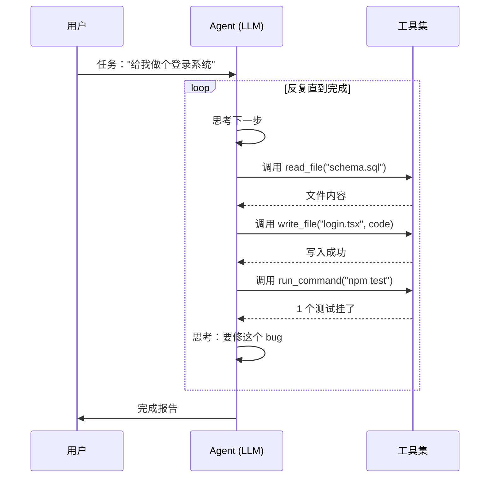

# A-07 Agent 是什么

## 一句话定义
Agent = **LLM + 工具 + "自己决定下一步做什么"的循环**。一次任务里它可能调用十几次工具、反复思考，直到把事情真正做完。

## 打个比方
- 普通 LLM = **能回答问题的学者**
- Function Calling = **学者+一台电话**（A-06）
- Agent = **学者+一台电话+一个会反复琢磨的脑子**：他不止打一通电话，他打完第一通后想"嗯还不够，我再打一通"，循环下去直到任务完成。

举个真实例子：你说"帮我订下周三去上海最便宜的高铁票"。
- 单次 LLM：编造一个航班号告诉你
- Function Calling（单步）：查一次价格，回你"最便宜 553"
- Agent：查 12306 → 发现下周三早上太贵 → 自己决定查下周四 → 比较 → 反过来建议你"建议改下周四，省 200" → 你说"好"→ 它真的去下单 → 完成

## 和 vibe coding 的关系
Cursor 的 Agent 模式、Claude Code、Replit Agent、Lovable 这些工具的**核心卖点都是 Agent**：
- 你说"给我加一个用户系统"
- Agent 自动：分析现有代码 → 决定改哪些文件 → 写迁移 SQL → 改 schema → 写前端登录页 → 跑测试 → 看到测试挂了 → 自己 debug → 再跑 → 完成

这就是为什么 2025 之后大家不再说"AI 写代码"，而是说"AI Coding Agent"——单步生成已经是上一代了。

## 典型场景 / 示例

**Agent 的核心循环**：

**常见的 Agent 形态**：
- **Coding Agent**：Cursor Agent / Claude Code / Devin / Replit Agent
- **Browser Agent**：能在浏览器里点按钮、填表单（Browser Use、Computer Use）
- **Research Agent**：自动搜资料并写报告（ChatGPT Deep Research、Perplexity）
- **业务 Agent**：你自己用 LangGraph / OpenAI Assistants API 搭的客服、销售 bot

## 常见误区
- ❌ **"Agent = 更聪明的 ChatGPT"**：不对。Agent 的关键是"循环 + 工具 + 自主决策"，而不是"更聪明"。同一个模型在 Agent 框架下能完成的事情，比单次对话多得多。
- ❌ **"Agent 一定贵"**：因为反复调用，token 消耗确实比单轮高 5-50 倍。但对于复杂任务，价值往往超过成本。
- ❌ **"Agent 能自己进化"**：不会。它在单次任务内会"反思",但任务结束就忘了。要积累经验，需要给它配长期记忆（向量库 / 数据库）。
- ❌ **"放手让 Agent 干就行"**：现阶段 Agent 仍会卡死、走错路、消耗大量 token。需要设上限（最多 N 步 / N 美元），以及人工 review 关键操作。

## 延伸阅读

### 📺 视频教程
- [Andrej Karpathy · Intro to Large Language Models](https://www.youtube.com/watch?v=zjkBMFhNj_g) `[英 · ⭐⭐ · 免费 · 2023 · 1h]` Karpathy 讲解 LLM 及 Agent 核心概念
- [AI Agent 从零到一 (B站)](https://www.bilibili.com/video/BV1q4421S7B5) `[中 · ⭐⭐ · 免费 · 2024 · 系列]` 中文系统讲解 Agent 架构
- [吴恩达 · AI Agents in LangGraph](https://www.deeplearning.ai/short-courses/ai-agents-in-langgraph/) `[英 · ⭐⭐ · 免费 · 2024 · 1h]` 用 LangGraph 构建 Agent
- [ReAct Pattern Explained (YouTube)](https://www.youtube.com/watch?v=0g2jZpj1vKg) `[英 · ⭐⭐ · 免费 · 2024 · 15min]` ReAct 推理+行动模式可视化

### 📰 文章
- [Anthropic: Building effective agents](https://www.anthropic.com/research/building-effective-agents) `[英 · ⭐⭐ · 免费 · 2024]` 当前最经典的 Agent 设计模式总结，必读。
- [OpenAI: Practical guide to building agents (PDF)](https://cdn.openai.com/business-guides-and-resources/a-practical-guide-to-building-agents.pdf) `[英 · ⭐⭐ · 免费 · 2025]` 偏工程实践的 Agent 指南。
- [LangGraph 文档](https://langchain-ai.github.io/langgraph/) `[英 · ⭐⭐⭐ · 免费 · 2024]` 最流行的 Agent 编排框架。

## 去问 AI
> 「请用'订外卖'的例子分别解释这三个的区别：单次 LLM 回答、单步 Function Calling、Agent。让我感受到 Agent 多出来的'自主决策'是什么。」

---
**来源**：① Anthropic 研究  ② OpenAI 指南  ③ LangGraph 文档
**查询日期**：2026-06-23 · **数据来源时间**：2024-2025
