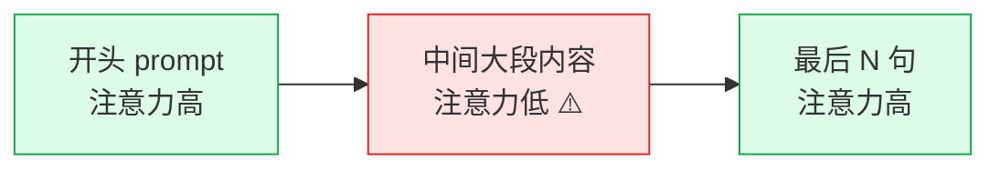

# B-04 上下文窗口：各模型多大、用满了会怎样

## 一句话定义
上下文窗口 = 模型一次能看到的"工作记忆"上限（按 token 数算）。**超过上限**就开始丢东西；**远未到上限但已经塞太多**也会"注意力衰减"——模型实际能利用的窗口往往比标称的小。

## 打个比方
**像桌面工作区**：
- 桌子大（1M token）≠ 同时盯着所有东西。
- 中间桌面那叠纸最容易被忽略，左右两端反而记得清——这就是 **"lost in the middle"** 现象。
- 桌子塞太满，找一张特定便签会越来越慢、越来越贵。



## 和 vibe coding 的关系
- 在 Cursor / Claude Code 里贴了一大段代码 → 实际占用 token = 代码 + 历史对话 + System Prompt + Cursor Rules
- 项目变大后老对话挤掉新对话，AI 就开始"忘开头"、瞎编不存在的文件
- **窗口大小决定 IDE 一次能"读懂"多大的项目**——这就是 Cursor 在大型项目里仍要用 RAG 检索的原因

## 典型场景 / 示例

### 主流模型上下文窗口对比（核实窗口 2026-06）

| 模型 | 标称窗口 | 真长上下文实测（128K 以上） |
|---|---|---|
| **GPT-4.1** | 1M | ★ NoLiMa 32K=79.8 / 64K=69.7（公开测试最强） |
| **GPT-5 系列** | 400K | ⚠️ 实测数据待官方/第三方公布 |
| **Gemini 2.5 / 3.x Pro** | 1M（>200K 价格上浮） | RULER 128K=94.4（Gemini-1.5-Pro 历史） / NoLiMa 32K=48.2（字面无关推理掉档） |
| **Claude Sonnet / Opus 当前版** | 1M（部分版本仍 200K） | 社区口碑稳定；公开实测数据较少 |
| **Claude Haiku 当前版** | 200K | — |
| **xAI grok-4 系列** | 1M | — |
| **DeepSeek V4-Pro / V4-Flash** | 1M | 同 V3 系列 |
| **Qwen3.7-max / Plus** | 1M | RULER 128K Qwen3-235B = 90.6 |
| **Qwen-flash / Plus 分段** | 256K-1M | 价格随 token 数分段上涨 |
| **Kimi K2.7 Code** | 256K | 中文表现强 |
| **GLM-5.2** | 1M | 长上下文为新主打 |
| **GLM-4.6** | 200K | — |
| **MiniMax-M3** | 1M（>512K 限量） | 2026-06-01 发布 |
| **MiniMax-M2.x** | 204K | — |

> 全部数据**查询日期：2026-06-23**，请以各家官方为准。

### 一次完整对话中的 token 消耗示意

假设上下文窗口 = 128K：
```
System Prompt（Cursor Rules / 角色设定）       ≈   1K
当前打开的文件代码                            ≈  15K
项目相关上下文（自动检索）                     ≈  10K
历史对话                                     ≈  20K
你这次的提问                                  ≈   2K
─────────────────────────────────
input 合计                                  ≈  48K
（剩 80K 可用）
模型生成回复                                  ≈   3K
```
看起来很轻松；但项目大了、对话变长，几小时后 input 可能逼近 100K，效果开始波动。

### 用满了会发生什么？
1. **硬截断**：超过窗口的部分被直接扔掉（通常扔最早的那部分），AI"忘了开头"
2. **软衰减**：还没到窗口上限，但模型在中间位置的检索准确率已经下降（lost in the middle）
3. **价格暴涨**：长上下文按 input token 计价；Gemini 等模型超过 200K 后单价上浮
4. **速度变慢**：input 越长，模型"读"的时间越久（首字延迟显著增加）

## 常见误区
- ❌ **"1M 窗口就可以塞 1M token 一直用"**：见 RULER / NoLiMa 数据，**几乎所有模型在到达声称长度前都已掉档**。1M 是营销数字，实际有效长度可能 32K-256K。
- ❌ **"token = 字符"**：中文 1 字 ≈ 1.5-2 token，英文 1 词 ≈ 1 token，代码 1 行 ≈ 5-30 token。详见 A-02。
- ❌ **"窗口大就不用 RAG 了"**：相反。窗口越大成本越高、注意力越分散；**长上下文 + RAG 是组合拳，不是替代关系**。
- ❌ **"窗口里塞越多上下文越好"**：与其塞 30K 全部代码，不如精选 5K 相关代码 + 清晰说明，效果通常更好。

## 延伸阅读
- [Anthropic: Long context prompting tips](https://docs.anthropic.com/en/docs/build-with-claude/prompt-engineering/long-context-tips) `[英 · ⭐⭐ · 免费 · 2024]` 长窗口怎么用得好的官方建议
- [Lost in the Middle 论文](https://arxiv.org/abs/2307.03172) `[英 · ⭐⭐⭐ · 免费 · 2023]`
- [RULER 仓库（NVIDIA）](https://github.com/NVIDIA/RULER) `[英 · ⭐⭐ · 免费 · 持续更新]`
- [NoLiMa 仓库（Adobe Research）](https://github.com/adobe-research/NoLiMa) `[英 · ⭐⭐⭐ · 免费 · 2024-2025]`
- [OpenAI Tokenizer](https://platform.openai.com/tokenizer) `[英 · ⭐ · 免费 · 常青]` 算 token 数最快的工具

## 去问 AI
> 「我想做一个'PDF 长合同审核 AI'，单份合同 ~50 页（约 30K token）。请告诉我：用 Gemini 2.5 Pro / GPT-4.1 / Qwen3.7-Max 哪个更合适？要不要加 RAG？预估每份合同的处理成本是多少？」

---
**来源**：① 各厂官方文档  ② RULER / NoLiMa 仓库 README  ③ Anthropic 长上下文官方建议
**查询日期**：2026-06-23 · **数据来源时间**：实测榜单 2024-2025；模型规格 2026-06
