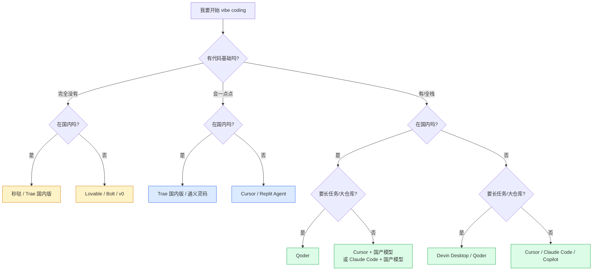

# C 决策树：vibe coding 工具选型

> 这张决策树帮你"选一个工具开始"——不要被 16 张卡淹没，先按这棵树走一遍，挑出 1-2 个候选试用。
> 决策依据：用户背景 + 国内/外网络环境 + 主要场景。

---

## 决策主干

---

## 5 类人群的"最短决策路径"

### 1. 完全零代码（产品 / 设计 / 运营 / 学生）

| 情况 | 推荐 | 备选 |
|---|---|---|
| **国内 · 做小程序 / H5 / 营销活动** | **C-15 秒哒**（no-code、托管在百度侧） | C-09 Trae 国内版（如想看到代码） |
| **国内 · 做能继续维护的 Web 应用** | **C-09 Trae 国内版**（免费档可上手） | C-10 通义灵码 个人免费 |
| **海外 · 做 SaaS / MVP / 落地页** | **C-03 Lovable** | C-04 v0、C-05 Bolt |
| **海外 · 想要更"全栈感"** | **C-05 Bolt.new** | C-06 Replit Agent |

> 这一类不需要装 IDE、不用学命令行；都是浏览器内聊天就出货。

---

### 2. 会一点代码（前端切图 / SQL / 简单脚本）

| 情况 | 推荐 | 备选 |
|---|---|---|
| **国内 · CNY 付款 · 想要独立 IDE** | **C-09 Trae 国内版** | C-10 通义灵码 + JetBrains |
| **国内 · 已用 VS Code 不想换 IDE** | **C-09 Trae 插件**（原 MarsCode） | C-08 GitHub Copilot（需海外网络） |
| **海外 · 想做 Web App** | **C-01 Cursor** | C-04 v0（前端） + Cursor（继续改） |
| **海外 · 已用 VS Code 不想换** | **C-08 GitHub Copilot** | Cursor（迁移成本小） |
| **手机 / iPad 写代码** | **C-06 Replit Agent** | — |

---

### 3. 有完整代码基础（独立开发者 / 全栈）

| 情况 | 推荐 | 备选 |
|---|---|---|
| **国内 · 重度日常 vibe coding** | **C-01 Cursor + 国产模型（B-07）** 或 **C-09 Trae 国内版** | C-02 Claude Code + 国产模型 |
| **国内 · 大型企业项目（Java / 私有部署）** | **C-10 通义灵码** | C-11 文心快码 Comate / C-12 CodeBuddy |
| **国内 · 长任务 / 大仓库 / 多 Agent 并行** | **C-13 Qoder**（底模 Qwen-Coder） | C-09 Trae Ultra |
| **海外 · 日常 vibe coding** | **C-01 Cursor** | C-02 Claude Code |
| **海外 · 重度 Claude 用户** | **C-02 Claude Code** | C-01 Cursor + Claude 模型 |
| **海外 · 大型仓库 + 多家模型同台** | **C-08 GitHub Copilot Max** | C-01 Cursor Ultra |
| **海外 · 长任务 / 24h 跑 Agent** | **C-07 Devin Desktop** | C-13 Qoder |

---

### 4. 团队 / 企业付费

| 情况 | 推荐 |
|---|---|
| **国内 · 大型团队** | C-10 通义灵码 / C-11 Comate / C-12 CodeBuddy（看主用云厂商） |
| **国内 · 中小团队 vibe coding 友好** | C-09 Trae 国内版企业 |
| **海外 · 已用 GitHub** | C-08 GitHub Copilot Business / Enterprise |
| **海外 · 完整 Agent 体系** | C-01 Cursor Team / C-07 Devin Desktop Teams |

---

### 5. 极度看重数据合规 / 自部署

| 情况 | 推荐 |
|---|---|
| **完全离线 / 私有部署** | C-10 通义灵码 企业版（私有化）+ 开源模型自部署 |
| **数据不能出公司** | Cursor 关闭隐私模式 + 自托管开源模型（B-06）|

---

## 5 个"快速过滤"问题

回答下面这 5 个问题，能在 2 分钟内把 16 个工具筛掉 80%：

1. **国内 / 国外网络？**
   国内 → 直接砍掉 C-07 Devin Desktop（仅强海外）、C-03 Lovable / C-04 v0 / C-05 Bolt（体验不稳）

2. **能用国际信用卡付款吗？**
   不能 → 砍掉所有海外工具，只看 C-09 ~ C-15

3. **写代码 vs 不写代码？**
   不写代码 → C-15 秒哒（仅国内）；C-03 Lovable（仅海外）

4. **要独立 IDE 还是插件？**
   独立 IDE：C-01 Cursor / C-07 Devin Desktop / C-09 Trae / C-13 Qoder
   插件：C-08 Copilot / C-10 灵码 / C-11 Comate / C-09 Trae 插件线 (原 MarsCode)
   纯 Web：C-03 / C-04 / C-05 / C-06 / C-15

5. **预算？**
   $0：C-01 / C-08 / C-09 国内版 / C-10 / 都有免费档
   $10-30/月：C-01 Cursor Pro / C-04 v0 Team / C-09 Trae Pro / C-08 Copilot Pro
   $100+/月：C-02 Claude Code Max / C-07 Devin Desktop Max / C-08 Copilot Max

---

## 常见误区（选工具时容易踩的坑）

- ❌ **"全网都推 Cursor，我就用 Cursor"**：如果你在国内、付款不方便、网络不稳，**Trae 国内版几乎一定更舒服**。Cursor 是"海外最优"，不是"全球最优"。
- ❌ **"工具越多越好"**：选 1-2 个深度用，比同时装 5 个浅用强 10 倍。
- ❌ **"换工具会丢工作"**：项目本身存在 GitHub 上，工具是临时驾驶舱。**随时可以换**。
- ❌ **"先存够钱再升级"**：试用一周如果觉得"省了的时间 > 月费"，立刻升级。vibe coding 工具的 ROI 一般很高。

## 延伸阅读
- C-01 ~ C-16 各工具卡（深入了解）
- B 组 模型选型（驾驶舱选好后挑大脑）
- D-04 Cursor Rules / D-02 MCP 配置（IDE 进阶配置）

## 去问 AI
> 「我是国内独立开发者，会一点 React，想做面向中文用户的 SaaS 工具。请你扮演 vibe coding 顾问：基于决策树，结合我的情况给我推荐主用 + 备用两个工具。并告诉我第一周该怎么用它做出第一个 demo。」

---
**查询日期**：2026-06-23 · **数据来源**：C-01 ~ C-16 + B 组结论
