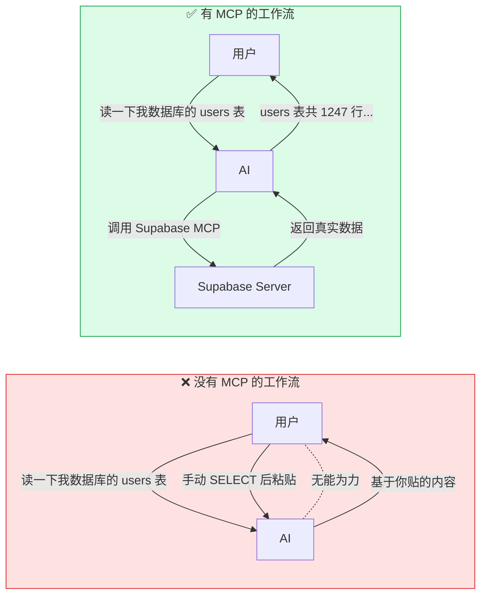

# D-01 什么是 MCP（Model Context Protocol）

## 一句话定义
MCP（Model Context Protocol）是 Anthropic 在 2024 年底开源的"AI 工具调用标准协议"——它定义了 **LLM ↔ 外部工具 / 数据源** 之间的统一接口，让任何模型都能"插上"任何遵循 MCP 的 server，**就像 USB 一样即插即用**。

## 打个比方
**MCP 像 USB-C 之于电子设备**：
- 没有 USB-C 前，每个设备一个奇形怪状的接口
- 有 USB-C 后，充电器、显示器、硬盘——统一一根线全搞定

LLM 世界 2024 年之前是这样的：
- Cursor 想接 GitHub 要写一份"Cursor ↔ GitHub" 集成
- Claude Code 想接 GitHub 也得写一份"Claude Code ↔ GitHub" 集成
- 同一个 GitHub 集成代码重复造 N 次

**MCP 出现后**：只要 GitHub 提供一个"MCP server"，所有遵循 MCP 协议的客户端（Cursor、Claude Code、Cline、Continue 等）都能即插即用。**M 个客户端 × N 个工具的笛卡尔积 → 简化为 M + N**。

## 和 vibe coding 的关系
- **2025 年下半年开始，几乎所有主流 AI IDE 都支持 MCP**
- **MCP server 已成为 vibe coder 的"扩展包"**：装一个 Supabase MCP，AI 就能直接读你的数据库；装一个 Browser MCP，AI 就能直接帮你打开网页测试
- 不会用 MCP 的 vibe coder ≈ 不会装插件的 VS Code 用户——能用但很多事情低效

## 典型场景 / 示例

### 有 MCP vs 没有 MCP 的工作流对比

### MCP 三方角色

| 角色 | 中文 | 例子 |
|---|---|---|
| **Host** | 宿主（你用的 IDE / 客户端） | Cursor、Claude Code、Cline、Continue、Zed |
| **Server** | MCP 服务端（提供具体能力） | Supabase server、GitHub server、Filesystem server、Stripe server |
| **Protocol** | 协议本身（JSON-RPC over stdio / SSE / HTTP） | MCP 规范 v1.x |

### 一个 MCP server 能干什么

| 能力 | 例子 |
|---|---|
| 提供 Tools | "调用 search_orders(user_id=...)"——AI 能执行的函数 |
| 提供 Resources | "暴露 /docs/api.md 的内容"——AI 能读取的数据 |
| 提供 Prompts | "预设好的 prompt 模板"——AI 可调用 |
| 双向交互 | AI ↔ Server 流式通信、采样、人在回路 |

## 常见误区
- ❌ **"MCP = 一种新 AI"**：不是。MCP 是**协议**，不是模型；它定义"模型怎么调工具"。
- ❌ **"MCP = Function Calling 的替代品"**：不矛盾。**Function Calling（A-06）是模型自己的能力**，MCP 是**把工具标准化打包的协议**——MCP server 内部仍然是用 Function Calling 让模型调用。
- ❌ **"用 MCP 一定快"**：MCP 多了一层网络往返，简单操作可能比直接代码慢；它的价值是"复用 + 标准化"而不是性能。
- ❌ **"必须装很多 MCP server"**：装 ≤5 个常用的就够。装太多反而让 AI"选错工具"。

## 延伸阅读

### 📺 视频教程
- [MCP 入门教程 (YouTube)](https://www.youtube.com/watch?v=kQmXtrmQ5Zs) `[英 · ⭐⭐ · 免费 · 2024 · 15min]` MCP 协议核心概念可视化讲解
- [MCP 实战：让 AI 连接你的工具 (B站)](https://www.bilibili.com/video/BV1rC41187rS) `[中 · ⭐⭐ · 免费 · 2024 · 20min]` 中文 MCP 实操入门
- [Anthropic MCP 官方演示](https://www.youtube.com/watch?v=0Bjy9SrXT4Q) `[英 · ⭐⭐ · 免费 · 2024 · 12min]` Anthropic 官方 MCP 介绍

### 📰 文章
- [Model Context Protocol 官网](https://modelcontextprotocol.io/) `[英 · ⭐⭐ · 免费 · 持续更新]` 最权威的官方文档
- [MCP 规范](https://modelcontextprotocol.io/specification) `[英 · ⭐⭐⭐ · 免费 · 持续更新]` 协议细节
- [Anthropic 官方 MCP 发布博客](https://www.anthropic.com/news/model-context-protocol) `[英 · ⭐⭐ · 免费 · 2024-11]` 协议诞生背景
- [MCP Servers Hub（GitHub）](https://github.com/modelcontextprotocol/servers) `[英 · ⭐⭐ · 免费 · 持续更新]` 官方 server 列表

## 去问 AI
> 「请用'电源插座 + 各种电器'的比方给我讲清楚 MCP：什么是 host？什么是 server？协议长什么样？为什么 2024 年才有它？」

---
**来源**：① https://modelcontextprotocol.io  ② https://www.anthropic.com/news/model-context-protocol
**查询日期**：2026-06-23 · **数据来源时间**：协议 2024-11 发布，2024-2026 持续演进
