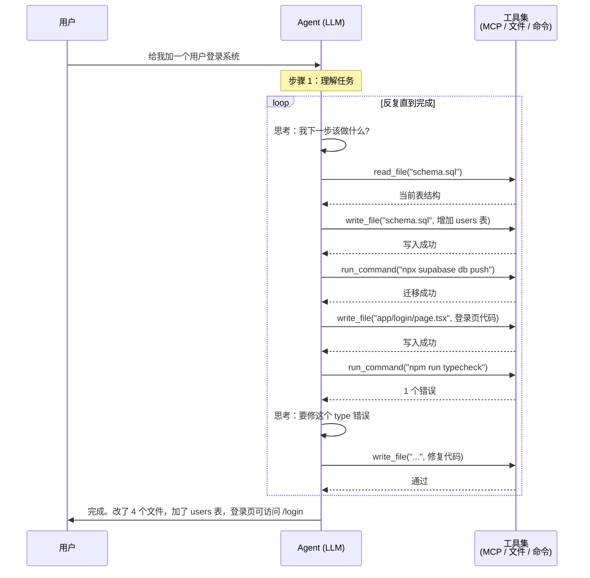

# D-05 Agent 模式

## 一句话定义
"Agent 模式" = 把 LLM 放进**「思考 → 调用工具 → 拿结果 → 再思考」的循环**里，让它在一次任务里做出几十次决策，直到任务真正完成（而不是只回一条消息就停）。

## 打个比方
普通对话 = **打电话**：你说一句、对面回一句，挂掉。
Agent 模式 = **派一个助理出去办事**：你说"帮我把电费交了"，他自己开门、走到楼下、找银行、查账户、刷脸、付款、回来汇报"已交"。中间几十个动作他自己做主，你只负责派任务。

## 和 vibe coding 的关系
- **Cursor / Claude Code / Replit Agent / Devin Desktop / Qoder 的核心卖点**都是 Agent 模式
- 你在 Cursor 按 `Cmd+I` 就是切到 Agent 模式
- 写一行"加一个用户登录系统"，AI 自动改十几个文件、跑测试、调整 schema
- **2026 年 vibe coding ≈ 用 Agent 模式干活**，不再是早期"AI 补全单行"

## 典型场景 / 示例

### Agent 模式的核心循环

### Agent 模式 vs 单次对话 vs Function Calling 单步

| 维度 | 单次对话 | Function Calling 单步 | Agent 模式 |
|---|---|---|---|
| 调用次数 | 1 次 | 1-2 次（1 次工具 + 1 次最终回复） | N 次（典型 5-50） |
| 自主决策 | 无 | 选哪个工具 | 选 + 顺序 + 何时停 |
| 适合任务 | 单条问答 | 单步查询/动作 | 多步骤任务（写代码、做研究、跑流程） |
| 成本 | 低 | 中 | 高（每次循环都烧 token） |
| 时间 | 秒级 | 秒级 | 分钟到小时 |
| 出错风险 | 低 | 低 | 高（中间任何一步错都会偏） |

### 当代 Coding Agent 的设计模式（来自 Anthropic "Building effective agents"）

1. **Prompt Chaining**：把大任务拆成几个小 prompt，按顺序跑
2. **Routing**：先用一个小模型分类"这任务该派给哪个 agent"
3. **Parallelization**：多个 agent 并行做不同部分
4. **Orchestrator-Workers**：一个 orchestrator agent 派活儿给 worker agents
5. **Evaluator-Optimizer**：一个 agent 写、另一个 agent 评分，循环优化

> 这些模式不是互斥的，复杂 Agent 通常组合使用。

### 控制 Agent 的"安全阀"

- **Max steps**：上限 20-50 步，避免死循环
- **Max tokens**：单任务最高 100K 输出，避免烧爆
- **Human-in-the-loop**：危险操作（删文件、推 main、退款）必须人工确认
- **Sandbox**：让 Agent 在 docker / dev container 里跑，限制能改的范围
- **Budget**：直接设美元上限（OpenAI / Anthropic 都有 spend limit）

## 常见误区
- ❌ **"Agent 自动跑就一定能做完"**：现阶段 Agent 在长任务（>20 步）上**有较高失败率**——会卡死、走错路、跑成 token 黑洞。需要给上限。
- ❌ **"Agent = 更聪明的 LLM"**：用的还是同一个 LLM，"聪明"加在外面的循环结构里。
- ❌ **"Agent 不需要 prompt 工程"**：恰好相反——Agent 对 System Prompt（D-04）的依赖比单次对话**更高**。
- ❌ **"打开 Agent 模式自动省钱"**：相反。Agent 模式 token 消耗常是单次对话的 5-50 倍。简单任务不要无脑 Agent。

## 延伸阅读
- [Anthropic: Building effective agents](https://www.anthropic.com/research/building-effective-agents) `[英 · ⭐⭐ · 免费 · 2024]` 当前最经典的 Agent 设计指南，必读
- [OpenAI: A practical guide to building agents (PDF)](https://cdn.openai.com/business-guides-and-resources/a-practical-guide-to-building-agents.pdf) `[英 · ⭐⭐ · 免费 · 2025]`
- [LangGraph 官方文档](https://langchain-ai.github.io/langgraph/) `[英 · ⭐⭐⭐ · 免费 · 持续更新]` 最流行的 Agent 编排框架
- A-07 Agent 是什么（基础概念）
- D-06 AI Skill / Tool 与 MCP 的关系

## 去问 AI
> 「我用 Cursor 的 Agent 模式让它'做用户系统'，结果它跑了 30 分钟、改了 50 个文件，最后还报错。请你告诉我：(1) 写好任务 prompt 应该长什么样？(2) 怎么给 Agent 设上限避免跑飞？(3) 中间发现走偏了我该怎么打断介入？」

---
**来源**：① https://www.anthropic.com/research/building-effective-agents  ② https://langchain-ai.github.io/langgraph/
**查询日期**：2026-06-23 · **数据来源时间**：2024-2026
