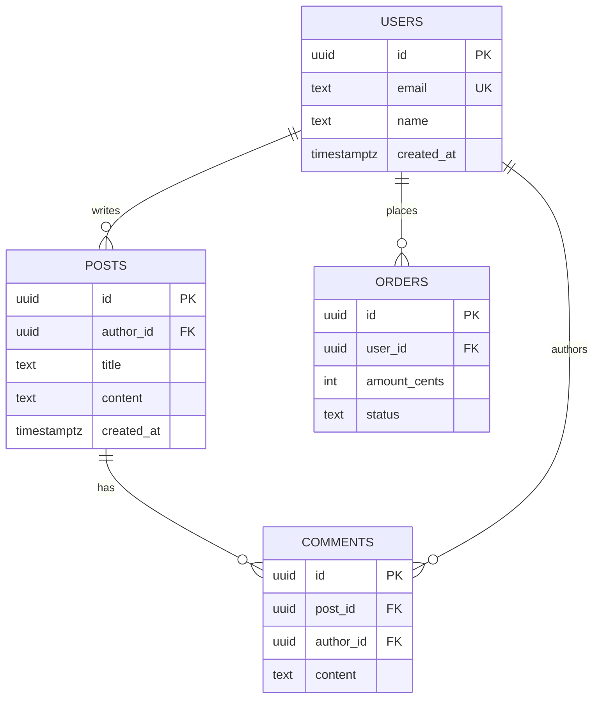

# F-02 数据库与 SQL 最小必要

## 一句话定义
**数据库**是结构化存储数据的地方（用户、订单、内容……）；**SQL（Structured Query Language）** 是和它对话的语言。**关系型数据库（Postgres / MySQL / SQLite）+ SQL** 是 vibe coding 默认选择。

## 打个比方
**数据库像一个 Excel 文件，但有"魔法"**：
- 多个 sheet（表）
- 行 = 记录、列 = 字段
- 不同 sheet 可以"关联"（订单表的 user_id 指向用户表的 id）
- 千万行也能秒查（建索引后）
- 多人同时读写不冲突

**SQL = 在 Excel 上用一句话查询**：
```sql
SELECT 姓名, 邮箱 FROM 用户表 WHERE 注册年份 = 2026 ORDER BY 注册时间 DESC LIMIT 10;
```

## 和 vibe coding 的关系
- **几乎每个产品都需要数据库**：用户表、内容表、订单表
- 推荐路径：**Supabase（F-03）= Postgres + Auth + Storage 全套云服务**，最适合独立开发者
- AI 写 SQL 很顺手——但**你得能看懂它在干啥**，不然万一它写了 `DELETE * FROM users WHERE 1=1` 你就完了

## 典型场景 / 示例

### 一个最小数据库结构（Mermaid）



- **PK** = 主键，唯一标识一行
- **FK** = 外键，指向另一个表的主键
- **UK** = 唯一约束（如 email 不能重复）
- `||--o{` = 一对多关系

### 你必须看得懂的 6 个 SQL 操作

```sql
-- 1. 建表（Supabase / Postgres）
create table posts (
  id uuid primary key default gen_random_uuid(),
  author_id uuid references users(id) on delete cascade,
  title text not null,
  content text,
  created_at timestamptz default now()
);

-- 2. 查（SELECT）
select id, title from posts
where author_id = 'xxx' and created_at > '2026-01-01'
order by created_at desc
limit 20;

-- 3. 增（INSERT）
insert into posts (author_id, title, content)
values ('xxx', '我的第一篇', '内容...');

-- 4. 改（UPDATE）—— 永远要带 where
update posts set title = '新标题' where id = 'yyy';

-- 5. 删（DELETE）—— 永远要带 where
delete from posts where id = 'yyy';

-- 6. 关联查询（JOIN）
select posts.title, users.name as author
from posts
join users on posts.author_id = users.id
where posts.created_at > '2026-01-01';
```

### vibe coding 时代你大概率不直接写 SQL

实际上你会用 **ORM**（对象关系映射，比如 Drizzle / Prisma / Supabase Client），让 SQL 变成 JS / TS 调用：

```ts
// Supabase 客户端
const { data } = await supabase
  .from("posts")
  .select("id, title, author:users(name)")
  .gt("created_at", "2026-01-01")
  .order("created_at", { ascending: false })
  .limit(20);
```

```ts
// Drizzle ORM
const posts = await db.select()
  .from(postsTable)
  .where(gt(postsTable.createdAt, "2026-01-01"))
  .orderBy(desc(postsTable.createdAt))
  .limit(20);
```

ORM 帮你把 JS 对象转成 SQL，**类型安全 + 不容易出 SQL 注入**。

## 常见误区
- ❌ **"NoSQL（MongoDB）一定比 SQL 好"**：早期 NoSQL 热潮已退。2026 年共识是：**绝大多数业务用 Postgres**（成熟、灵活、有 jsonb 字段也能存 NoSQL 数据）。
- ❌ **"UPDATE / DELETE 不带 where"**：经典翻车——会把整张表改掉 / 删空。**任何写 SQL 时先看 where 条件**。
- ❌ **"AI 写 SQL 不用 review"**：AI 偶尔会生成性能炸的 SQL（N+1 查询、缺索引的 JOIN）。生产前看一眼 EXPLAIN。
- ❌ **"建表后不用想"**：表结构（schema）是后期最难改的东西之一。**前期多想 30 分钟，后期少哭一天**。
- ❌ **"主键用自增整数"**：可以，但 UUID 更安全（不容易被人 id+1 猜出来）+ 分布式友好。Supabase 默认用 UUID。

## 延伸阅读
- [PostgreSQL 官方文档（中文）](https://www.postgresql.org/docs/) `[英 · ⭐⭐⭐ · 免费 · 持续更新]`
- [SQLBolt 互动教程](https://sqlbolt.com/) `[英 · ⭐ · 免费 · 常青]` 15 分钟学会基础 SQL
- [菜鸟教程 SQL（中文）](https://www.runoob.com/sql/sql-tutorial.html) `[中 · ⭐ · 免费 · 持续更新]`
- [Supabase 数据库文档](https://supabase.com/docs/guides/database) `[英 · ⭐⭐ · 免费 · 持续更新]` 实战 Postgres
- [Drizzle ORM](https://orm.drizzle.team/) `[英 · ⭐⭐ · 免费 · 持续更新]` 2026 最火 TS ORM
- F-03 Supabase（独立开发者首选）

## 去问 AI
> 「我要做一个用户笔记 SaaS。请用 Mermaid ER 图设计表结构，再用 Supabase SQL 给出建表语句。涉及：用户、笔记、标签（多对多）、收藏。每张表都要写明字段、PK、FK、索引建议。」

---
**来源**：① PostgreSQL 官方文档  ② Supabase 文档  ③ SQLBolt
**查询日期**：2026-06-23 · **数据来源时间**：常青
