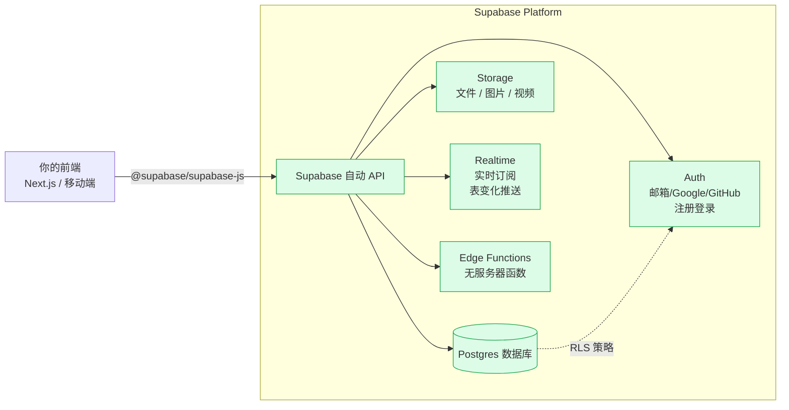

# F-03 Supabase

## 一句话定义
Supabase 是"**开源版 Firebase**"——给你一套 **托管的 Postgres 数据库 + 用户认证 + 文件存储 + 实时订阅 + 自动 REST/GraphQL API + Edge Functions**，一个仪表盘搞定，**独立开发者最常用的后端基础设施**。

## 打个比方
传统做后端 = **盖一栋楼**：自己买地、画图、雇工人、布线、装空调……几个月才能搬进去。
Supabase = **直接租好的精装写字楼**：电、水、空调、安保、电梯都有了，你只管摆桌椅（写业务）。
和 Firebase 比，Supabase 用的是开放的 Postgres，**关键时刻可以一键自部署或迁出**——不会被绑死。

## 和 vibe coding 的关系
- **2026 年独立开发者后端的事实选择**——Lovable / v0 / Cursor 默认推荐
- 一个项目顶 4-5 个传统组件（DB + Auth + Storage + Realtime + API）
- 免费档对独立开发者足够撑到月活几千

## 典型场景 / 示例

### Supabase 架构（Mermaid）



### 30 分钟快速开始

```bash
# 1. 在 supabase.com 注册，新建一个项目（免费）
# 2. 拿到 project URL 和 anon key
# 3. 在你的 Next.js 项目装客户端
npm install @supabase/supabase-js
```

`.env.local`：
```
NEXT_PUBLIC_SUPABASE_URL=https://xxxxx.supabase.co
NEXT_PUBLIC_SUPABASE_ANON_KEY=eyJ...
```

`lib/supabase.ts`：
```ts
import { createClient } from "@supabase/supabase-js";

export const supabase = createClient(
  process.env.NEXT_PUBLIC_SUPABASE_URL!,
  process.env.NEXT_PUBLIC_SUPABASE_ANON_KEY!
);
```

调用：
```ts
// 查
const { data, error } = await supabase
  .from("posts")
  .select("*")
  .limit(10);

// 增
await supabase.from("posts").insert({ title: "hello", content: "world" });

// 注册
await supabase.auth.signUp({ email, password });

// 登录
await supabase.auth.signInWithPassword({ email, password });

// 当前用户
const { data: { user } } = await supabase.auth.getUser();
```

### Row Level Security（RLS）—— 必学

Supabase 最大的特点是 **RLS**：直接在数据库层面写"谁能读哪一行"的策略。

```sql
-- 在 Posts 表上启用 RLS
alter table posts enable row level security;

-- 策略：所有人都能读已发布的
create policy "anyone can read published posts"
  on posts for select
  using (status = 'published');

-- 策略：作者本人能改自己的
create policy "users can update own posts"
  on posts for update
  using (auth.uid() = author_id);
```

写好 RLS 后，**前端直接调 API 就安全了**——不用专门写后端验权。

### 定价（核实窗口 2026-06）

- **Free**：免费起步，含 500MB DB + 1GB Storage + 50K MAU
- **Pro**：$25/月起，含 8GB DB + 100GB Storage + 100K MAU
- **Team**：$599/月起
- **Enterprise**：联系销售

> 准确额度请查 https://supabase.com/pricing。**查询日期：2026-06-23**。

## 常见误区
- ❌ **"不写 RLS 直接前端调"**：等于把数据库密码贴到首页——**任何人都能读写任何表**。**RLS 是必学**。
- ❌ **"anon key 是 secret"**：anon key 设计上就是公开的（要让浏览器用），**真正的 secret 是 service_role key**（千万别放前端）。
- ❌ **"Supabase = Firebase 但更便宜"**：定位不同。Firebase 用 NoSQL（Firestore）；Supabase 用 Postgres（关系型）。**业务复杂时 Postgres 更顺手**。
- ❌ **"Auth 只能用邮箱"**：内置 Google / GitHub / Apple / Phone OTP / Magic Link / Anonymous 等十几种；详见 F-04。
- ❌ **"免费档跑不起 SaaS"**：能撑很久。月活几百到几千都没问题。

## 延伸阅读

### 📺 视频教程
- [Supabase 官方教程 (YouTube)](https://www.youtube.com/watch?v=7uKQBl9uZ00) `[英 · ⭐⭐ · 免费 · 2024 · 20min]` 官方入门教程
- [Supabase + Next.js 实战 (YouTube)](https://www.youtube.com/watch?v=8KJtTvbRygM) `[英 · ⭐⭐ · 免费 · 2024 · 45min]` 全栈项目搭建
- [Supabase 中文教程 (B站)](https://www.bilibili.com/video/BV1ZM4m1y7Pm) `[中 · ⭐⭐ · 免费 · 2024 · 系列]` 中文系统教程
- [Supabase Crash Course (YouTube)](https://www.youtube.com/watch?v=dU-xk852pvk) `[英 · ⭐⭐ · 免费 · 2023 · 1h]` 快速上手

### 📰 文章
- [Supabase 官网](https://supabase.com) `[英 · ⭐⭐ · 免费起 · 持续更新]`
- [Supabase 文档](https://supabase.com/docs) `[英 · ⭐⭐ · 免费 · 持续更新]`
- [Supabase 中文文档（社区维护）](https://supabase.com/docs/guides/getting-started/quickstarts/nextjs) `[英 · ⭐⭐ · 免费 · 持续更新]`
- [Supabase 定价](https://supabase.com/pricing) `[英 · ⭐ · 免费 · 持续更新]`
- F-02 数据库 / SQL · F-04 Auth · F-05 .env · F-06 Edge Functions

## 去问 AI
> 「我要做一个'个人笔记 SaaS'，用 Next.js + Supabase。请给我完整的 30 分钟搭建步骤：(1) 在 Supabase 建什么表；(2) RLS 策略怎么写；(3) Next.js 项目里怎么集成；(4) 怎么实现注册登录登出。给完整代码 + SQL，能直接复制运行。」

---
**来源**：① https://supabase.com/docs  ② https://supabase.com/pricing
**查询日期**：2026-06-23 · **数据来源时间**：2026-06
