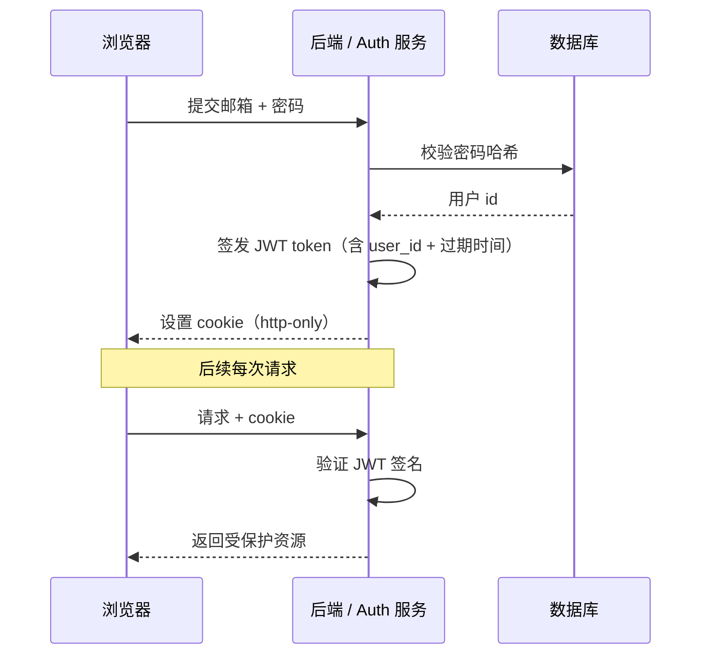

# F-04 Auth 登录系统

## 一句话定义
Auth = "身份认证 + 会话管理"——回答两个问题：**你是谁？**（身份认证）+ **你这次访问还有效吗？**（session / token）。**几乎所有产品都要做，但绝对不要自己手撸**。

## 打个比方
**做 Auth 像建保安系统**：
- 登记证件（注册） + 发门禁卡（颁发 token）
- 进门刷卡（每次请求带 token）
- 卡过期重发（refresh token）
- 24h 通行证 vs 永久员工卡（session 时长）
- 不同区域不同权限（RBAC）

99% 独立开发者不应该自己造这套——**用现成服务**。

## 和 vibe coding 的关系
- 几乎每个 SaaS 都需要 Auth
- 推荐路径：**Supabase Auth（最简单）** / **Clerk（最美）** / **NextAuth.js**（最自由开源）
- 实际花费时间：**30 分钟接好，剩下精力放在产品上**

## 典型场景 / 示例

### 主流 Auth 方案对比（核实窗口 2026-06）

| 方案 | 类型 | 价格 | 国内可用 | 适合 |
|---|---|---|---|---|
| **Supabase Auth** | 托管 | 免费 50K MAU，详见 F-03 | ✅ 直连 OK | 已用 Supabase 的项目，零成本 |
| **Clerk** | 托管，UI 最美 | 免费 10K MAU 起 | 需国际网络 | 注重登录页 UI、海外用户 |
| **Auth0**（Okta） | 托管，企业级 | 免费 25K MAU 起 | 需国际网络 | 企业 / SSO 需求 |
| **NextAuth.js (Auth.js)** | 开源 npm 包 | 完全免费 | ✅ | 想完全控制 + 不绑死托管 |
| **Better Auth** | 开源 npm 包（新） | 完全免费 | ✅ | 想要 TS-first、完全可定制 |
| **Lucia Auth** | 开源 npm 包 | 完全免费 | ✅ | 极简、要自己拼 |

> 价格变化频繁，请以各家官网为准。

### 三种主流登录方式

1. **Email + Password**：经典，但要做密码强度 / 找回密码 / 验证邮箱
2. **OAuth（Google / GitHub / Apple / Microsoft）**：一键登录，用户体验最好
3. **Magic Link / OTP**：发邮件 / 短信验证码，无密码，越来越流行

**最佳实践**：邮箱密码 + Google OAuth 两个都给（覆盖最广人群）。

### Supabase Auth 最小完整示例

```ts
// 注册
const { data, error } = await supabase.auth.signUp({
  email: "user@example.com",
  password: "secure-password",
});

// 登录
await supabase.auth.signInWithPassword({ email, password });

// 第三方
await supabase.auth.signInWithOAuth({ provider: "google" });

// 当前用户
const { data: { user } } = await supabase.auth.getUser();

// 监听登录状态变化
supabase.auth.onAuthStateChange((event, session) => {
  // event: SIGNED_IN / SIGNED_OUT / TOKEN_REFRESHED
});

// 登出
await supabase.auth.signOut();
```

### Session 是怎么工作的



### 几个绝对要做的安全实践

1. **密码用 bcrypt / argon2 哈希**（不要 MD5、不要明文）—— 任何托管服务都自带
2. **JWT cookie 必须 `httpOnly` + `secure` + `sameSite`**—— 防 XSS 偷 token
3. **关键操作要二次验证**—— 改密码、改邮箱、删账号、付款时重新验
4. **rate limit**—— 限制登录 / 注册接口防爆破
5. **邮箱验证**—— 注册后发链接 / OTP，避免假邮箱注册

> 用 Supabase Auth / Clerk 这类托管服务，**以上 5 条它都帮你做了**。

## 常见误区
- ❌ **"自己写 Auth 没多难"**：你能想到的坑只是冰山一角（CSRF、timing attack、refresh token 滥用、邮箱枚举…）。**别自己造**。
- ❌ **"localStorage 存 token 没事"**：会被 XSS 偷。**用 httpOnly cookie**。
- ❌ **"Auth 完了不用管"**：还要管：忘记密码、改邮箱、注销账号、GDPR 删数据、bot 防御。
- ❌ **"OAuth = Google 一键代替密码"**：本质是 Google 帮你存了密码 + 把"是这个人"这件事告诉你。但你的应用仍要存 user 记录。

## 延伸阅读

### 📺 视频教程
- [NextAuth.js 完整教程 (YouTube)](https://www.youtube.com/watch?v=DJvM2lSPn6w) `[英 · ⭐⭐ · 免费 · 2024 · 30min]` OAuth + Credentials 登录
- [Clerk Auth 快速入门 (YouTube)](https://www.youtube.com/watch?v=ZacHD4OU8_k) `[英 · ⭐⭐ · 免费 · 2024 · 15min]` Clerk 托管方案演示
- [Supabase Auth 实战 (B站)](https://www.bilibili.com/video/BV1ZM4m1y7Pm) `[中 · ⭐⭐ · 免费 · 2024 · 25min]` 中文 Auth 配置教程
- [Auth 安全最佳实践 (YouTube)](https://www.youtube.com/watch?v=F-sFp_AvHc8) `[英 · ⭐⭐ · 免费 · 2024 · 20min]` JWT / Session / 安全细节

### 📰 文章
- [Supabase Auth 文档](https://supabase.com/docs/guides/auth) `[英 · ⭐⭐ · 免费 · 持续更新]`
- [Clerk 官网](https://clerk.com) `[英 · ⭐⭐ · 免费起 · 持续更新]`
- [Auth.js (NextAuth)](https://authjs.dev) `[英 · ⭐⭐ · 免费 · 持续更新]`
- [Better Auth](https://www.better-auth.com) `[英 · ⭐⭐ · 免费 · 持续更新]` 2025 新晋热门
- [OWASP Authentication Cheat Sheet](https://cheatsheetseries.owasp.org/cheatsheets/Authentication_Cheat_Sheet.html) `[英 · ⭐⭐⭐ · 免费 · 持续更新]` 自己造时必看的安全清单
- F-03 Supabase（含 Auth）

## 去问 AI
> 「我用 Next.js 14 + Supabase。请教我接 Auth 的完整流程：(1) Supabase 控制台要配什么（Email + Google）；(2) 前端登录注册登出页面代码；(3) 怎么保护需要登录的路由（用 middleware 或 server component）；(4) `auth.uid()` 在 RLS 里怎么用。给完整可跑代码。」

---
**来源**：① https://supabase.com/docs/guides/auth  ② https://clerk.com  ③ OWASP
**查询日期**：2026-06-23 · **数据来源时间**：常青（具体定价 2026-06）
