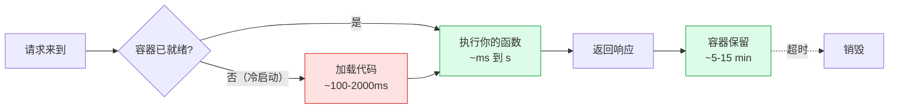

# F-06 Serverless / Edge Function

## 一句话定义
**Serverless（无服务器）** = 你写一段函数，平台帮你跑 + 自动扩容 + 按调用次数收钱——**你不用管"服务器在哪儿"**。
**Edge Function** = serverless 的进化版，函数跑在**全球边缘节点**（离用户最近的机房）—— 延迟低、启动快。

## 打个比方
- **传统服务器** = 自己开一家全天营业的奶茶店——24h 都要付店租，没生意也要付
- **Serverless** = 用美团接单，**有人下单时才让师傅做**，按订单收钱（冷启动 = 师傅得先穿围裙）
- **Edge Function** = 全国每个城市都有一个"快闪点"——下单后 10 秒上桌，无冷启动

## 和 vibe coding 的关系
- **Next.js API 路由 / Server Actions 默认就跑在 serverless** 上（Vercel 自动这么部署）
- 写 Vercel / Cloudflare Workers 等就是写 Edge Function
- 独立开发者**几乎不用自己搭服务器**——靠 serverless + 托管数据库（Supabase）就能跑完整 SaaS

## 典型场景 / 示例

### Serverless 函数生命周期



- **冷启动**：第一次请求 / 一段时间没请求后，容器要重新启动 → 慢
- **热启动**：容器已在，立刻执行 → 快

### Edge vs Node runtime（Vercel / Cloudflare）

| 维度 | Node runtime (serverless) | Edge runtime |
|---|---|---|
| 跑在哪 | 一个区域的数据中心 | 全球边缘节点 |
| 冷启动 | 100-2000ms | < 50ms（V8 isolate） |
| API 支持 | 完整 Node.js（fs / crypto / Buffer） | 限制版（无 fs、有限 npm 包） |
| 单次最大执行 | 通常 10s-15min（看平台） | 通常 < 30s |
| 内存 | 高（128MB-3GB） | 低（128MB） |
| 适合 | 重计算、数据库长查询、依赖 Node 库 | 静态生成、AI 流式响应、地理位置感知 |

**经验法则**：
- 默认用 serverless (Node)
- 需要"低延迟首字 + 流式"才换 Edge（如 ChatGPT-like 流式接口）

### Next.js 里指定 runtime

```ts
// app/api/chat/route.ts
export const runtime = "edge";   // 或 "nodejs"（默认）

export async function POST(req: Request) {
  // ...
}
```

### 主要 serverless / edge 平台（核实窗口 2026-06）

| 平台 | 特点 |
|---|---|
| **Vercel Functions** | Next.js 默认，自动 serverless |
| **Cloudflare Workers** | Edge 王者，免费额度最大 |
| **Netlify Functions** | 接 Netlify 部署的项目 |
| **AWS Lambda** | 最老牌、最强大，配置复杂 |
| **Supabase Edge Functions** | Deno-based、跑在 Supabase 项目里 |
| **Deno Deploy** | Deno 官方 |
| **国内：阿里云函数计算 FC** | 国内主流 |
| **国内：腾讯云 SCF** | 国内主流 |
| **国内：CloudBase 云函数（微信云）** | 微信小程序生态 |

## 常见误区
- ❌ **"serverless 一定省钱"**：高 QPS 时反而**比自部署贵**。盈亏平衡点通常在持续 ~10 QPS 左右。
- ❌ **"无冷启动问题"**：低流量函数会"冷"。流式 AI 接口要小心首字延迟。**解决方案**：定时 warm up / 用 Edge runtime / 上 always-on（更贵）。
- ❌ **"serverless 适合长连接 / WebSocket"**：不适合。**WebSocket 用专门服务**（Pusher / Ably / Supabase Realtime 等，见 F-07）。
- ❌ **"内存能无限大"**：每个平台都有上限（通常 1-3GB）和单次执行时间上限（10s-15min）。**重计算任务该用 worker queue 或专用服务**。
- ❌ **"Edge 一定比 serverless 快"**：首字快、总耗时不一定。冷启动后 serverless 的执行可能更快（更大内存 / CPU）。

## 延伸阅读
- [Vercel Functions 文档](https://vercel.com/docs/functions) `[英 · ⭐⭐ · 免费 · 持续更新]`
- [Cloudflare Workers 文档](https://developers.cloudflare.com/workers/) `[英 · ⭐⭐ · 免费起 · 持续更新]`
- [Supabase Edge Functions 文档](https://supabase.com/docs/guides/functions) `[英 · ⭐⭐ · 免费 · 持续更新]`
- [12 Factor App](https://12factor.net/zh_cn/) `[中 · ⭐⭐ · 免费 · 常青]`
- E-05 Next.js · G 组各部署平台

## 去问 AI
> 「我要做一个'实时 AI 翻译' SaaS——用户输入英文、流式输出中文。请帮我设计：(1) Next.js 14 的 API 路由用 Edge runtime 还是 Node？(2) 部署到 Vercel 还是 Cloudflare Workers 更合适？(3) 如何避免冷启动毁掉首字延迟？给完整代码 + 部署建议。」

---
**来源**：① Vercel / Cloudflare / Supabase 官方文档  ② 12 Factor App
**查询日期**：2026-06-23 · **数据来源时间**：常青（平台具体定价请查官网）
