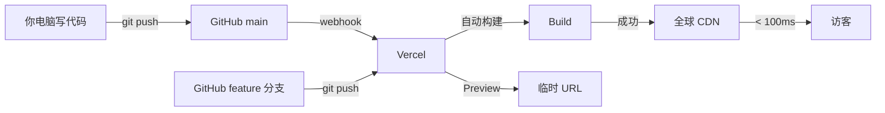

# G-01 Vercel：从 GitHub 到上线全流程

## 一句话定义
Vercel 是 Next.js 的"亲生平台"——把 GitHub 上的 Next.js 项目接过来，**自动构建、自动部署、自动 HTTPS、自动全球 CDN**，是 vibe coder 海外上线的事实标准。

## 打个比方
**像把一份 Word 文档上传到 Google Docs**：你把 Next.js 项目 push 到 GitHub，Vercel 自动接管"打包 + 加载到全球服务器 + 给你一个公网链接"——你不用管"哪台机器跑、怎么开端口、SSL 证书"。

## 和 vibe coding 的关系
- **海外 vibe coder 的默认部署平台**
- Cursor / v0 / Lovable / Bolt 等几乎都默认推荐 Vercel
- Next.js（E-05）的高级特性（ISR、Image Optimization、Edge Middleware、AI SDK 流式）**只在 Vercel 上是最佳支持**

## 典型场景 / 示例

### 关键事实（核实窗口 2026-06）

| 字段 | 内容 |
|---|---|
| 产品形态 | 静态托管 + Serverless Functions + Edge Functions + KV / Postgres / Blob 数据存储 |
| 公司 | Vercel |
| 官方网站 | https://vercel.com |
| 定价页 | https://vercel.com/pricing |
| Next.js 支持 | ★★★ 行业最强（官方平台） |

### 定价（核实窗口 2026-06，⚠️ 抓取受限：以下为 **2025-05 公开快照**，2026 时点请以官网为准）

> 本次 Explore 多轮尝试都未能抓到 2026 时点 vercel.com/pricing 的实时内容（含 Wayback Machine 也 fetch failed）。**下面是 2025-05 的最后稳定公开快照**。

#### Hobby（免费档）— 仅个人非商业
| 资源 | 配额 |
|---|---|
| 月费 | $0 |
| 商业用途 | **不允许**（agency / freelance / 任何盈利项目都需要 Pro） |
| 带宽（Fast Data Transfer） | 100 GB / 月 |
| Edge Requests | 1,000,000 / 月 |
| 构建分钟 | 6,000 / 月（或 100 deploys / 天） |
| 超额处理 | 达上限直接暂停项目（不收钱、必须升级） |

#### Pro — **$20 / 月 / seat**（每个 seat 含独立资源池，多 seat 累加）
| 资源 | 每个 seat 含 | 超额单价 |
|---|---|---|
| 带宽（Fast Data Transfer） | 1 TB | $0.15 / GB（北美/欧洲） |
| Fast Origin Transfer | 100 GB | — |
| Edge Requests | 10,000,000 | $2 / 百万次 |
| Function Invocations | 1,000,000 | $0.60 / 百万次 |
| Function Duration | 1,000 GB-Hrs | $0.18 / GB-Hr |
| Active CPU | 1,000 hours | — |
| 构建分钟 | 24,000 / 月 | $0.01 / 分钟 |
| Image Optimization | 5,000 source images | $5 / 1,000 source images |

#### Enterprise — Custom（无公开标价）
- 常见公开复盘数字：起步年合同 $20K–$25K / 年
- 含：SAML SSO / Audit Logs / SLA / HIPAA / 专属支持 / 定制 region / IP allowlist / Dedicated IP

> **2024-04 后计费模型变更**：旧的 "Serverless Function Execution" 拆成三项独立计费（Function Invocations / Function Duration / Edge Requests），"Bandwidth" 拆成 "Fast Data Transfer" 与 "Fast Origin Transfer"。2024-03 前的复盘文章已不适用。
>
> **⚠️ "Pro+" 档**：截至 2025-05 Vercel 公开层级仍只有 Hobby / Pro / Enterprise 三档。2025 下半年到 2026 上半年是否新增 Pro+ 档未能核实——**请用户访问 https://vercel.com/pricing 确认**。

### 国内能否直连
- **国内访问 vercel.app 子域名长期不稳**：经常被运营商干扰 / 封锁
- 自定义域名 + 接 Cloudflare 可缓解
- **国内访问优先的用户**应该看 G-07 Zeabur / G-09 EdgeOne Pages 等

---

## 全流程实操：从 0 到上线 + 自定义域名 + HTTPS（30 分钟）

### Step 1：准备代码到 GitHub（5 分钟）
```bash
# 假设你已有 Next.js 项目
git init
git add .
git commit -m "initial"
gh repo create my-app --public --source=. --push
# （或在 github.com 网页建仓库，然后 git remote add + git push）
```

### Step 2：连接 Vercel（5 分钟）
1. 打开 https://vercel.com → 用 GitHub 账号登录
2. 点 "Add New..." → "Project"
3. 选择你刚才那个 GitHub 仓库
4. Vercel 自动识别"这是个 Next.js 项目"
5. （重要）在 **Environment Variables** 区粘贴你的 `.env.local` 内容（详见 F-05）
6. 点 "Deploy"

### Step 3：等构建（2-5 分钟）
Vercel 会显示实时构建日志。完成后给你一个临时域名（如 `my-app-abc123.vercel.app`）。

### Step 4：买域名 + 解析（10 分钟）
1. 在 Namecheap / Cloudflare / 阿里云 / Porkbun 等买一个域名（年费 ¥40-200）
2. 在 Vercel：Project Settings → Domains → 加上你的域名（如 `myapp.com`）
3. Vercel 告诉你"需要配置两个 DNS 记录"：
   ```
   A     @     76.76.21.21
   CNAME www   cname.vercel-dns.com
   ```
4. 去你的域名注册商 / Cloudflare DNS 控制台加上这两条
5. 等 DNS 生效（几分钟到 24 小时）

### Step 5：自动 HTTPS
- DNS 一生效，**Vercel 自动签发 Let's Encrypt 证书**——零配置 HTTPS
- 浏览器锁图标变绿，搞定

### Step 6：从今往后
- 每次 `git push` 到 main 分支 → 自动重新部署
- 在其他分支 push → 生成 **Preview 部署**（独立链接，可分享）
- 在 PR 上评论会自动放预览链接



## 常见误区
- ❌ **"Hobby 档能商用"**：Vercel ToS 明确 Hobby 仅个人非商业。商业项目必须升级到 Pro。
- ❌ **"免费用量无限"**：Hobby 带宽（约 100GB/月）、Function 调用、构建分钟都有硬上限。流量大的项目要预估好。
- ❌ **"Edge Function 比 Serverless 一定好"**：Edge 有内存 / Node API 限制。**默认用 serverless (Node)**，需要低延迟流式才换 Edge（详见 F-06）。
- ❌ **"用了 Vercel 就被绑死"**：可以一键 export 静态、可以迁到 Cloudflare/Netlify（要改一些 ISR/Edge 写法）。**Next.js 本身开源**。
- ❌ **"环境变量改完立刻生效"**：要**重新部署一次**才生效（点 "Redeploy"）。

## 延伸阅读

### 📺 视频教程
- [Vercel 部署 Next.js 教程 (YouTube)](https://www.youtube.com/watch?v=ZVnjDlHP3vY) `[英 · ⭐⭐ · 免费 · 2024 · 15min]` Vercel 部署完整流程
- [Vercel + Next.js 一键部署 (B站)](https://www.bilibili.com/video/BV1ZM4m1y7Pm) `[中 · ⭐⭐ · 免费 · 2024 · 20min]` 中文部署教程
- [Vercel 自定义域名配置 (YouTube)](https://www.youtube.com/watch?v=dU-xk852pvk) `[英 · ⭐ · 免费 · 2024 · 10min]` 域名绑定演示

### 📰 文章
- [Vercel 官方文档](https://vercel.com/docs) `[英 · ⭐⭐ · 免费 · 持续更新]`
- [Vercel 定价](https://vercel.com/pricing) `[英 · ⭐ · 免费 · 持续更新]`
- [Vercel 模板库](https://vercel.com/templates) `[英 · ⭐ · 免费 · 持续更新]` 各种现成模板一键克隆部署
- [Vercel Functions 文档](https://vercel.com/docs/functions) `[英 · ⭐⭐ · 免费 · 持续更新]`
- E-05 Next.js · F-05 .env · G-12 域名 / DNS

## 去问 AI
> 「我有一个 Next.js 14 + Supabase + Stripe 项目要部署到 Vercel。请给我一份逐步检查表：(1) push 到 GitHub 前要确认什么；(2) Vercel 项目设置里要填哪些环境变量；(3) 第一次部署成功后该测什么；(4) 怎么配 myapp.com 自定义域名 + HTTPS。完整命令 + 截图位置说明。」

---
**来源**：① https://vercel.com  ② https://vercel.com/docs
**查询日期**：2026-06-23 · **数据来源时间**：2026-06（具体定价 ⚠️ 待人工核实）
