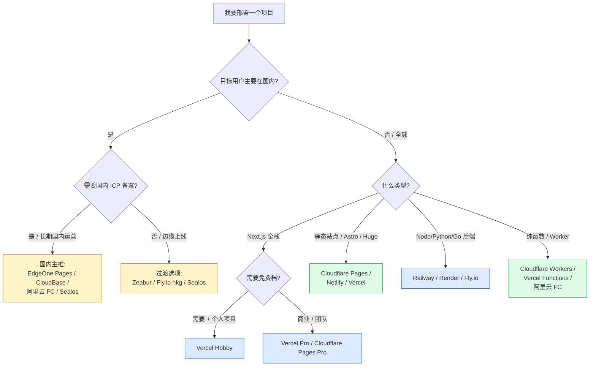

# G 选型：部署平台怎么选

> 看完 G-01 ~ G-11 觉得"11 个都不错怎么选"？这张表帮你 2 分钟做决策。
> 推荐都是"基于 2026-06 时点 + 公开定价"，具体数字仍以各平台官网为准。

---

## 决策树（按场景）

---

## 一张表说清楚 11 个平台（核实窗口 2026-06）

| # | 平台 | 类型 | 起步价 | 国内可达 | Next.js 支持 | 适合场景 |
|---|---|---|---|---|---|---|
| **G-01** | **Vercel** | 静态+Serverless+Edge | 个人免费 / Pro ~$20 | 差 | ★★★ 最强 | Next.js 全栈、海外用户 |
| **G-02** | **Netlify** | 静态+Serverless | Free 300 credits/月 / Personal $9 / Pro $20 | 中 | ★★ 跟随 Vercel | Astro/Hugo/Eleventy、多人小团队 |
| **G-03** | **Cloudflare Pages+Workers** | Edge 静态+Workers | **Free 免费档极慷慨** / Pro $20 | 中（不稳） | ★★（Edge runtime） | 极致省钱、全球低延迟、R2 文件存储 |
| **G-04** | **Railway** | 容器 PaaS（按秒） | $5 试用 / Hobby $5 / Pro $20 | 中 | ★（通用容器） | Node/Python/Go 后端、需要 DB 一键开 |
| **G-05** | **Render** | 容器 PaaS | **Free 仍有** / Pro $25 + compute | 中 | ★（通用） | 想要 Free Web + Postgres |
| **G-06** | **Fly.io** | 多区域 microVM | 纯按量（无 Free） | **优**（hkg/nrt 节点） | ★（通用） | 全球低延迟、WebSocket、Docker |
| **G-07** | **Zeabur** | 全栈 PaaS（国内友好） | Free / Dev $5 / Pro $19 | 优 | ★★ | 国内独立开发者、想用支付宝 |
| **G-08** | **Sealos** | K8s 云 OS | 7 天试用 / 按量 | 优 | ★（通用） | K8s 用户、AI 应用（pgvector 等） |
| **G-09** | **EdgeOne Pages/Makers** | 边缘 Pages（国内） | **永久 Free（推广期）** | 极优 | ★★ | 国内访问优先、Next.js 全栈 |
| **G-10** | **阿里云 FC** | Serverless 函数 | 按量 折扣 0.000088 元/CU | 极优 | ★（函数视角） | AI 推理后端、小程序 / 微信 |
| **G-11** | **CloudBase** | 微信 BaaS+全栈 | 免费体验 / 个人 ¥19.9 | 极优 | ★（云函数视角） | 微信小程序后端、AI Coding 一体化 |

---

## 5 类场景 · "三选一" 推荐

### 🌐 场景 1：海外 / 全球用户的 Next.js SaaS
1. **Vercel Pro** —— 完整生态、ISR / Edge / AI SDK 最强
2. **Cloudflare Pages + Workers** —— 极致省钱、全球低延迟
3. **Netlify Pro** —— 团队多成员、Vercel 替代

### 🇨🇳 场景 2：国内用户的 Next.js / 全栈 Web
1. **EdgeOne Pages**（推广期永久免费） —— 国内访问极优、Next.js 全栈支持好
2. **Zeabur Dev/Pro** —— 中文界面、支付宝付款、海外服务器
3. **Sealos** —— 想要 K8s 灵活度 + AI 向量库

### 💻 场景 3：Node / Python / Go 后端
1. **Railway Hobby $5** —— UI 最好、按秒计费
2. **Render Hobby + compute** —— Free Web + Free Postgres
3. **Fly.io hkg 节点** —— 国内用户友好 + 多区域

### 📁 场景 4：纯静态 / 个人博客 / 落地页
1. **Cloudflare Pages**（带宽不限免费） —— 极致免费
2. **Vercel Hobby** —— 个人非商业
3. **Netlify Free** —— 备选

### 🤖 场景 5：AI 推理 / 函数 / 小程序后端
1. **阿里云 FC**（国内 AI 推理首选） —— GPU 全系卡型 + AgentRun
2. **CloudBase**（微信生态） —— 个人版 ¥19.9，AI IDE 友好
3. **Cloudflare Workers** —— 海外用户、Edge 启动快

---

## "我该怎么开始" - 推荐 3 套套餐

### 套餐 A：海外独立开发者，月预算 ≤$10
- 部署：**Vercel Hobby**（免费）+ 自定义域名 ¥80/年
- 数据库：**Supabase Free**（F-03）
- 域名：**Cloudflare Domains**（成本价）
- **月成本：~$0**

### 套餐 B：国内独立开发者，月预算 ≤¥50
- 部署：**EdgeOne Pages**（推广期免费）或 **Zeabur Dev $5**
- 数据库：**CloudBase 个人版 ¥19.9** 或 **Supabase Free**
- 域名：**阿里云万网** ¥70/年 + ICP 备案
- **月成本：¥20-50**

### 套餐 C：全球 + 国内同时友好
- 海外节点：**Vercel Pro** 跑前端
- 国内节点：**EdgeOne Pages** 跑前端（同代码两边部署）
- 后端 API：**Fly.io hkg + nrt** 多区域 Docker（覆盖中美）
- 数据库：**Supabase 海外 + 数据多区域复制**
- **月成本：~$50-100**

---

## 常见误区（选平台时）

- ❌ **"Vercel = 唯一答案"**：在国内做产品请重新考虑。
- ❌ **"免费档够用"**：算清"Free 档撑到多少 DAU"——常见的 100GB 带宽免费档实际撑得住的远比想象少。
- ❌ **"换平台很麻烦"**：Next.js 项目本身可移植，主要差异在 ISR / Edge 写法。**第一次部署不必赌一辈子**。
- ❌ **"国内一定要 ICP 备案"**：不一定。**用 EdgeOne 默认子域名 / 海外服务器 + 海外域名 / 用 Cloudflare 中国国际线路**都能跳过，但**正式商业运营建议备案**。
- ❌ **"按量计费一定省"**：低流量省，高流量贵。**预估 DAU + 单次成本** 再下决定。

## 延伸阅读
- G-01 ~ G-13 各平台 / 知识详细卡
- F-03 Supabase（最常配的数据库后端）
- F-05 .env（部署平台环境变量配置）

## 去问 AI
> 「我要做一个面向全球（含国内）用户的 Next.js + Supabase + Stripe SaaS，预计前 3 个月 0 收入。请基于本卡的决策树，给我推荐：(1) 主部署平台；(2) 备份平台；(3) 域名怎么选；(4) 第一个月预期成本；(5) DAU 涨到 1 万时该怎么升级架构？」

---
**查询日期**：2026-06-23 · **数据来源**：G-01 ~ G-13 各卡
