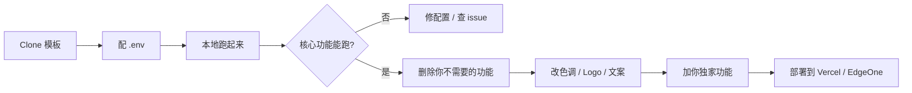

# Skills 仓库 · starter-templates.md

> 本文件提供 **T-01 ~ T-06 可直接 clone 的起步模板**——按"做什么类型产品"分类，每个模板都给出：技术栈、含功能、开源模板链接 + 一句话使用建议。
> ⚠️ 模板链接活跃度变化快，**使用前先打开 README 看最近更新日期 + star 数**。

---

## 目录

| # | 模板 | 适合做什么 |
|---|---|---|
| T-01 | SaaS Starter | 完整 SaaS（Auth + 订阅 + Dashboard） |
| T-02 | 落地页 / 产品官网 | 产品发布前的 marketing 站 |
| T-03 | 个人工具 / 小应用 | 单一功能的工具站 |
| T-04 | AI 对话 | ChatGPT-like 对话产品 |
| T-05 | 文件处理 | 上传 / 处理 / 下载工作流 |
| T-06 | 内容站 / 博客 | Markdown 驱动的内容网站 |

---

## T-01 · SaaS Starter（最重磅）

### 包含功能
- Next.js 14 App Router + TypeScript + Tailwind + shadcn/ui
- 完整 Auth（邮箱 / Google / GitHub）
- Stripe 订阅（月付 / 年付 / 多档位 / Customer Portal）
- Dashboard 模板（侧边栏 + 统计卡片 + 表格）
- 落地页 + 定价页 + 文档站

### 推荐模板（按推荐度）

| 模板 | 技术栈 | 是否付费 | 链接 |
|---|---|---|---|
| **Next.js SaaS Starter（leerob 官方）** | Next.js + Drizzle + Postgres + Stripe | 免费 MIT | https://github.com/leerob/next-saas-starter |
| **ShipFast (Marc Lou)** | Next.js + MongoDB / Supabase + Stripe / LemonSqueezy | $199 起 | https://shipfa.st |
| **Supabase Next.js Starter** | Next.js + Supabase Auth | 免费 | https://github.com/vercel/next.js/tree/canary/examples/with-supabase |
| **T3 Stack (create-t3-app)** | Next.js + tRPC + Prisma + NextAuth | 免费 | https://create.t3.gg |
| **MakerKit** | Next.js + Supabase | $299 起 | https://makerkit.dev |
| **Saas-UI** | Next.js + Chakra | $147 起 | https://saas-ui.dev |

### 一句话使用建议
- **0 预算**：用 leerob 的 `next-saas-starter` 或 `with-supabase` 起步
- **省时间最重要**：买 ShipFast / MakerKit，1-2 周到付费用户
- **要学全栈**：用 T3 Stack，技术栈最完整最现代

### 上手 5 步
```bash
# 1. clone
npx create-next-app@latest --example with-supabase my-saas
cd my-saas

# 2. 装依赖
pnpm install

# 3. 配 .env.local（参考 .env.example）
# - Supabase URL/Keys（https://supabase.com 创建项目）
# - Stripe Keys（https://stripe.com）

# 4. 跑数据库迁移
pnpm db:push

# 5. 启动
pnpm dev
```

---

## T-02 · 落地页 / 产品官网

### 包含功能
- Hero + Features + Pricing + FAQ + Footer 完整 sections
- 响应式、深色主题、SEO 优化
- 通常无后端，纯静态 + 表单接 Formspree / Tally

### 推荐模板

| 模板 | 技术栈 | 链接 |
|---|---|---|
| **Magic UI Pro Templates** | Next.js + Tailwind + Framer Motion | https://magicui.design/templates |
| **shadcn/ui Examples** | Next.js + Tailwind + shadcn | https://ui.shadcn.com/examples |
| **Aceternity Templates** | Next.js + Tailwind | https://ui.aceternity.com/templates |
| **Tailwind UI Templates** | Tailwind | https://tailwindui.com（付费）|
| **Astro Landing Page** | Astro + Tailwind | https://github.com/onwidget/astrowind |

### 一句话使用建议
- 用 Magic UI Pro / shadcn examples 起步，几小时内出第一版
- 配合 v0.app 生成定制 section，再粘到模板里

### 上手
```bash
# Astro 例子
pnpm create astro@latest -- --template onwidget/astrowind
```

---

## T-03 · 个人工具 / 小应用

### 包含功能
- 单一功能（比如：图片压缩 / Markdown 转 PDF / JSON 格式化）
- 纯前端，零后端
- 部署成本几乎 0（Vercel / Cloudflare Pages 免费档）

### 推荐模板

| 模板 | 类型 | 链接 |
|---|---|---|
| **Vite + React Starter** | 通用 | `pnpm create vite@latest my-app -- --template react-ts` |
| **Next.js Minimal** | 通用 | `npx create-next-app@latest --typescript --tailwind --app` |
| **Astro Starter** | 性能优先 | `pnpm create astro@latest` |

### 一句话使用建议
- 工具类首选 **Vite + React**——构建快、bundle 小
- 想做"在浏览器里离线跑的小工具"用 Vite，不要用 Next.js（多余）
- 想要 PWA / 可装机用 [Vite PWA Plugin](https://vite-pwa-org.netlify.app/)

### 范例参考
- ToolPilot / Tinywow / Convertio 这类工具站，源码模板可在 GitHub 搜 "online tool starter"

---

## T-04 · AI 对话

### 包含功能
- ChatGPT-like UI（消息列表 + 输入框 + 流式输出）
- 多模型切换（OpenAI / Anthropic / 国产）
- 多轮对话历史
- 可选：图片上传、文件上传、tool calling

### 推荐模板

| 模板 | 技术栈 | 链接 |
|---|---|---|
| **Vercel AI Chatbot（官方）** | Next.js + Vercel AI SDK + 多模型 | https://github.com/vercel/ai-chatbot |
| **Chatbot UI** | Next.js + Supabase（开源 ChatGPT 替代）| https://github.com/mckaywrigley/chatbot-ui |
| **LobeChat** | 国产开源、多模型友好、UI 极美 | https://github.com/lobehub/lobe-chat |
| **librechat** | 多用户、多模型、企业级开源 | https://github.com/danny-avila/LibreChat |

### 一句话使用建议
- **想快速起一个**：用 Vercel AI Chatbot（官方模板，集成度最好）
- **想 self-host 完整体验**：用 LobeChat（中文文档好）
- **企业级 / 多用户**：LibreChat

### 上手（Vercel AI Chatbot）
```bash
# 一键 deploy 到 Vercel
# https://vercel.com/templates/next.js/nextjs-ai-chatbot

# 或本地
git clone https://github.com/vercel/ai-chatbot
cd ai-chatbot
pnpm install
# 配 OPENAI_API_KEY / AUTH_SECRET / POSTGRES_URL 等
pnpm dev
```

---

## T-05 · 文件处理（上传 / 处理 / 下载）

### 包含功能
- 上传组件（拖拽 / 选择，含进度条）
- 后端文件处理（图像压缩 / 格式转换 / PDF 处理 / AI 分析）
- 下载结果

### 推荐模板 / 工具

| 模板 / 库 | 用途 | 链接 |
|---|---|---|
| **uploadthing** | 完整文件上传服务（含 SDK + 后端） | https://uploadthing.com |
| **Vercel Blob** | Vercel 自家文件存储 | https://vercel.com/docs/storage/vercel-blob |
| **R2 + Cloudflare Workers** | 零 egress 费的最便宜方案 | https://developers.cloudflare.com/r2/ |
| **Supabase Storage** | 已用 Supabase 的项目首选 | https://supabase.com/docs/guides/storage |
| **sharp**（图像处理库） | 服务端图像缩放 / 压缩 | https://sharp.pixelplumbing.com |
| **pdf-lib** | 浏览器端 PDF 编辑 | https://pdf-lib.js.org |
| **ffmpeg.wasm** | 浏览器内视频处理 | https://ffmpegwasm.netlify.app |

### 一句话使用建议
- 单次小文件 → uploadthing 或 Vercel Blob，几行代码搞定
- 海量文件 / 出站流量大 → R2（零 egress）
- 想极致省钱 → R2 + Cloudflare Workers

### 上手（uploadthing）
```bash
npm install uploadthing @uploadthing/react
# 配 UPLOADTHING_TOKEN
# 复制官方文档里的 5 行代码即可上传
```

---

## T-06 · 内容站 / 博客

### 包含功能
- Markdown / MDX 内容
- 文章列表 + 详情页 + 标签 + 搜索
- RSS / sitemap / SEO
- 评论（可选 Giscus / Disqus）

### 推荐模板

| 模板 | 技术栈 | 风格 | 链接 |
|---|---|---|---|
| **Fumadocs** | Next.js + MDX，文档站友好 | 文档 | https://fumadocs.dev |
| **Nextra** | Next.js + MDX，Vercel 出品 | 文档 / 博客 | https://nextra.site |
| **Astro Starlight** | Astro，零运行时 JS，极快 | 文档 | https://starlight.astro.build |
| **Hugo Blog** | Hugo（Go），构建超快 | 博客 | https://gohugo.io |
| **Tailwind Nextjs Starter Blog** | Next.js + Tailwind + MDX | 个人博客 | https://github.com/timlrx/tailwind-nextjs-starter-blog |
| **Astro Paper** | Astro，简洁博客 | 极简博客 | https://github.com/satnaing/astro-paper |

### 一句话使用建议
- 写**技术文档** → Fumadocs / Nextra / Starlight
- 写**个人博客** → Astro Paper / Tailwind Nextjs Starter Blog
- 文章超过 1000 篇 / 构建速度优先 → Hugo

### 上手（Astro Paper）
```bash
pnpm create astro@latest -- --template satnaing/astro-paper
```

---

## 选模板的 5 个原则

1. **看 last commit**：超过 6 个月没更新的 = 跳过（依赖一定老）
2. **看 star 数**：1k+ star 至少证明社区在用
3. **看 issue / PR**：作者活跃响应说明在维护
4. **看技术栈是否符合 .cursorrules**：和你团队约定一致才省事
5. **MIT / Apache License 优先**：避免 license 雷

---

## 怎么"魔改"模板？



**新手最容易踩的坑**：**还没把模板跑起来就开始改**——一定先在本地完整跑通，再动一行代码。

---

## 起步模板的"反模式"

- ❌ **重复造轮子**：模板已有 Auth / Stripe，不要自己再写一遍
- ❌ **不读模板 README**：往往埋了"必须先做 X"的坑
- ❌ **clone 完不删多余功能**：留着多余功能 = 多余维护成本
- ❌ **依赖模板，不学原理**：能跑 ≠ 你懂——花 1 小时读关键文件
- ❌ **盲目升级依赖**：模板的 lockfile 是经过验证的，升级前看 changelog

---

**最后更新**：2026-06-23 · 推荐模板列表会变化，使用前查 README
